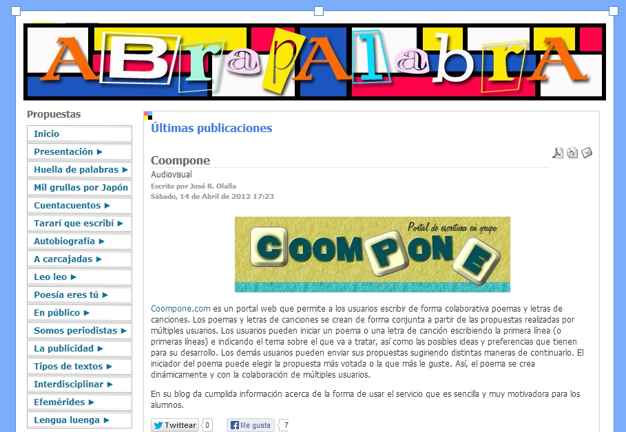
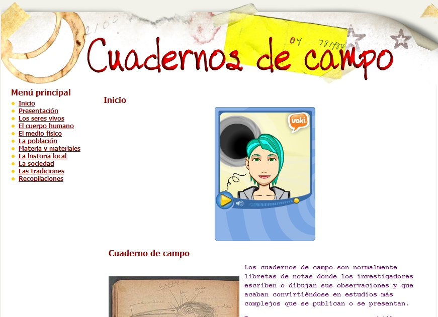

# Ampliación de contenidos

## Para Saber Más

### Tipos de proyectos colaborativos**

### Algunos ejemplos

*   **Prensa escolar**: el País de los estudiantes, primer premio 2009 (_Latitud 39º_ del IES Marratxí) [►](http://es.calameo.com/read/000051550381c240c7397).

*   **Selección de proyectos de Nuria Salvador**: La página de Nuria de Salvador tiene una amplia selección de proyectos colaborativos que nos puede ayudar a hacernos una idea más amplia. Como aparece clasificada en distinta forma en los dos enlaces siguientes es de fácil consulta. No están todos, por supuesto, pero es una buena selección.
    *   Organizados por temas [►](http://www.xtec.es/~nsalvado/spring/spring_2005/temas.htm)
    *   Proyectos de aula telemáticos [►](http://www.xtec.es/~nsalvado/spring/)
*   **Abrapalabra **un proyecto de lectura y escritura muchas veces colaborativo y con reflejo en los blog creativos de alumnos, aulas y colectivos. [►](http://abrapalabra.catedu.es/)

### Cuadernos de **campo**

Para investigar el medio en colaboración y compartir conclusiones [►](http://www.catedu.es/cuaderno_campo/).

*   **Multitud de herramientas**: en la sección [una herramienta para compartir y colaborar](mailto:) hemos incluido herramientas específicas web 2.0 que permiten colaborar en el aula. También de las secciones una maleta de recursos y un lugar para crear pueden obtenerse ideas.
*   Desde luego, las **wikis **y los**blog **son herramientas de construcción colaborativa.
*   [Educalia](http://www.educared.net/educalia/esp/index.htm?idapr=44_1603_esp_1__) propone algunos proyectos colaborativos.

### Proyectos  internacionales:

*   **[eTwinning](http://www.etwinning.net/es/pub/index.htm): **El más ambicioso proyecto que tenemos a nuestro alcance de colaboración entre centros del ámbito europeo es eTwinning que permite el hermanamiento con centros de todos los países y el desarrollo de cualquier trabajo colaborativo a gusto de los participantes**.**
*   [**Xplora **](http://www.xplora.org/ww/en/pub/xplora/index.htm)dedicado a las Ciencias que ofrece la posibilidad de trabajarlas en inglés, francés o alemán.
*   [**Proyecto Globe**](http://www.globe.gov/?&lang=es&nav=1). Cuenta con la participación de estudiantes y profesores de todo el Planeta y sus objetivos son:
    *   Mejorar la conciencia ambiental de las personas en todo el mundo;
    *   Contribuir a la comprensión científica de la Tierra; y
    *   Ayudar a que los estudiantes alcancen mayores niveles de aprendizaje en ciencia y matemáticas.
*   [**Global School Net**](http://www.globalschoolnet.org/index.cfm): Pensada específicamente para el trabajo del Inglés, Global School Net es un portal que concentra un gran número de proyectos posibles para el trabajo de ese idioma.
*   [**ePals comunity**](http://www.epals.com/): ePALS es un ejemplo de un auténtico servicio de intercambio de experiencias docentes a través del correo escolar entre alumnos y entre docentes.
*   [**Eduteka**](http://www.eduteka.org/directorio/index.php?sid=631843751&t=sub_pages&cat=279): Proyectos colaborativos ordenados por áreas.

    by <a title="View David Sánchez-Barbudo Miranda's profile on Scribd" href="https://es.scribd.com/user/48795234/David-Sanchez-Barbudo-Miranda#from_embed"  style="text-decoration: underline;" >David Sánchez-Barbudo Miranda</a> on Scribd
<iframe class="scribd_iframe_embed" title="20 Propuestas de Aprendizaje Colaborativo en La Web 2.0" src="https://www.scribd.com/embeds/117406937/content?start_page=1&view_mode=scroll&access_key=key-1qswes54210rvr2lc6ov&show_recommendations=true" data-auto-height="false" data-aspect-ratio="0.714172604908947" scrolling="no" id="doc_71174" width="100%" height="600" frameborder="0"></iframe>

## Reflexión

**¿Cuál es nuestro papel como docentes?**

Hemos dicho en alguna ocasión que el cambio no está en los medios, sino en los profesionales del sistema educativo. Por encima de leyes educativas cambiantes y de la costumbre docente se impone la pedagogía del sentido común, que no está basada en la repetición de modelos magistrales y memorísticos que nosotros mismos aprendimos (y sufrimos) cuando éramos estudiantes, sino en aulas abiertas a la vida donde la realidad no es un obstáculo sino un aliciente y el libro de texto no es un muro que impide mirar por la ventana ni el currículo un impedimento para un aprendizaje que tiende hacia la vida adulta y activa y no a la participación en saber y ganar.

Un aprendizaje que construye significados personales y compartidos en la mente de unos alumnos que no sólo adquieren información sino que desarrollan habilidades para seleccionarla, organizarla e interpretarla y establecen conexiones significativas con sus conocimientos previos. Alumnos que, en fin, aprenden a aprender y a emprender, para desarrollarse personalmente y desarrollar lo colectivo. Por eso aprenden juntos, en equipos cooperativos y se hacen más responsables, autónomos, integradores e integrados.

Una propuesta cooperativa, constructivista, creativa, textual (lectora y escritora) y tecnológica, que utiliza Internet para construir aprendizajes significativos porque Internet y todo lo que venga después pertenecen al mundo real y al mundo futuro para el que se preparan. Transformar la información en conocimiento implica analizarla, relacionarla, criticarla, transferirla y aplicarla.

¿Y nosotros? Sencillo, como decía al principio: a ser profesionales del sistema educativo, a aproximarnos al estilo docente que nos reclama: a abandonar nuestro protagonismo cediéndolo a los alumnos; a cambiar el papel de transmisores de conocimientos por el de mediadores entre la información y el conocimiento, el contenido y el aprendizaje de los alumnos.