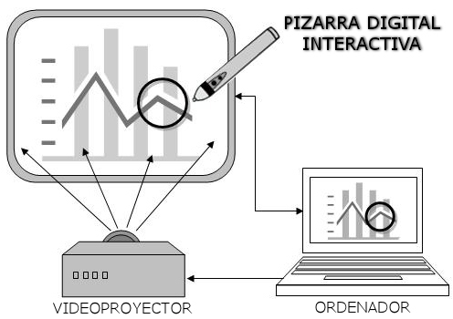

# ELEMENTOS

La Pizarra Digital interactiva cuenta con:
 
1. Un **ordenador fijo**, conectado a:
	- Un **videoproyector**, que permite visualizar al alumnado la pantalla del monitor.
	- Una **pizarra interactiva**, que hace las veces de dispositivo de:
		* **Entrada** de información, ya que permitirá que aquello que se escriba o accione en ella, tenga efecto en el ordenador.
		* **Salida**, ya que mostrará en todo momento, gracias al proyector, la imagen del monitor del ordenador.
2. Opcionalmente, un **lápiz electrónico** para escribir sobre la pizarra interactiva. Si ésta es táctil, es suficiente con la mano.
3. Unos **altavoces**, para poder escuchar en buenas condiciones el sonido que sale de la computadora.
4. Un **mando a distancia** o un cuadro de mandos en la pared, para poder accionar el videoproyector.

El sistema PDI requiere la siguiente secuencia de encendido:
1. **Encender el ordenador.**
1. **Encender el videoproyector**. Para este proceso, se dispondrá de un mando a distancia y se pulsará sobre la tecla ON, o bien, puede pulsarse la misma tecla si existe un cuadro de mandos en la pared cercana a la pizarra. 
1. **Encender los altavoces**, siempre y cuando se vayan a utilizar y dispongan de interurptor.

Para apagar el sistema el proceso será similar:

1. **Apagar el videoproyector**. Hay que recordar qe para alargar la duración de la lámpara interna del cañón, es preciso dejar funcionar uno o dos minutos el ventilador interno del que dispone. Por esta razón, si existe un interrupto que corta la alimentación, no debemos pulsarlo hasta pasar este tiempo prudencial.
1. **Apagar el ordenador**.
1. **Apagar los altavoces**, siempre que se disponga de un interruptor cercano.

Por supuesto, el proceso de apagado puede evitarse previo acuerdo con las necesidades de utilización del profesor siguiente en entrar en el aula.

Algunos modelos de pizarra precisan de **tiza digital** (**puntero**) , otros son táctiles y, para usarlas, utilizamos los dedos o unos punteros que nos permiten trabajar a una distancia idónea para que no haya interferencias en el trazo. Estas son las funciones de los botones del rotulador.

Usa el rotulador, puntero o dedo sobre la pizarra con el cuerpo suficientemente alejado, de manera que ni la palma de la mano ni el codo toquen la superficie. Si alguna parte del cuerpo se acerca a menos de 1 cm de su superficie, el funcionamiento se verá afectado por la interferencia y puede producirse una doble escritura.

Para trazar caracteres o imágenes con el rotulador electrónico, apoya la punta sobre la pizarra y desliza el rotulador. Al levantar la punta del rotulador de la superficie, la escritura queda completada. Recuerda:
- Mantener el rotulador lo más perpendicular posible a la superficie
- Aplicar la fuerza suficiente para hacer que la punta se retraiga hacia adentro.
- La punta del rotulador electrónico encierra un minitransmisor. Si al trazar caracteres o imágenes sujetas el rotulador electrónico por el transmisor, dificultar la transmisión. Si los caracteres o las imágenes trazadas sobre la pizarra no se importan correctamente al PC, cambia tu forma de sujetar el rotulador y, a continuación, verifica que los datos se muestran correctamente.

Si la punta del puntero/dedo no te coinciden con el cursor o lápiz, mira el Ejercicio Resuelto, donde te hablamos de la calibración.

# Caso práctico

Que la marca del puntero o dedo coincida con mayor o menor exactitud con el lugar de la pizarra donde se colocan, depende de la **calibración** de la misma.

En algunas PDIs, existe un botón de calibrado colocado en el mismo marco de la pizarra, que nos permite calibrar sin tener que entrar en el software propio de la PDI.

Pero en muchas otras hay que calibrar **entrando en el programa propio de la pizarra**.

En la retroalimentción encontrarás **videotutoriales** del proceso en esta y otras marcas (Smart y Promethean).

%accordion%Solución%accordion%

Hitachi (StarBoard 9.20):

https//www.youtube.com/watch?v=pDTd-thOjVQ

Smart:

https//www.youtube.com/watch?v=a3F8UgVbBd4

Promethean:

https//www.youtube.com/watch?v=JLZ5Uh3Oerw

%/accordion%

# Tarea

OPCIONAL:

Aunque no hemos estudiado el software propio de la PDI, vamos intentar encenderla y calibrarla. Para ello busca en el escritorio o en Inicio &gt; Programas el nombre del programa que tengas instalado en tu ordenador de aula y ejecútalo. Según el modelo intenta seguir las pautas marcadas y realizar la calibración.

Puedes consultar cualquier duda que te surja en el proceso.

