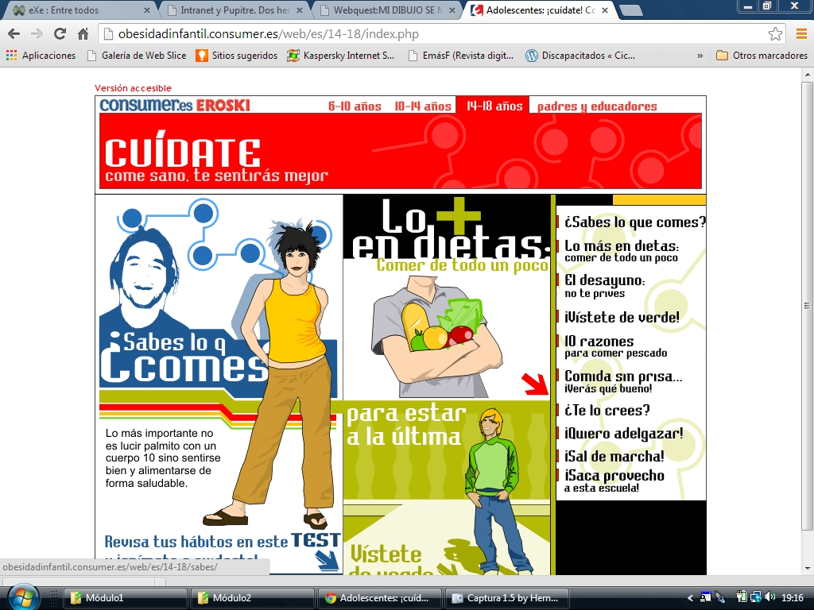
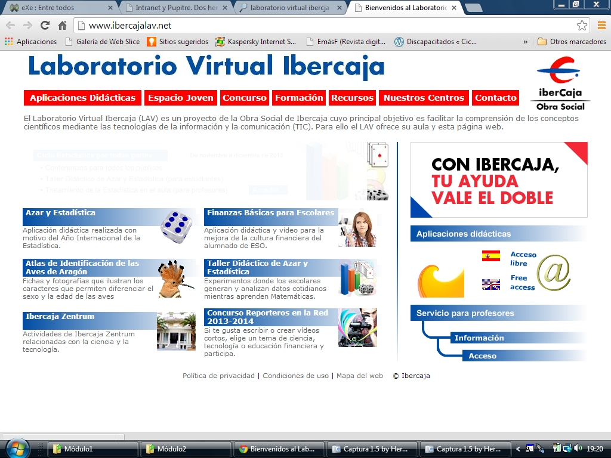

# Entre todos

**Corrección de tareas entre todos**

- Resulta mucho más sencillo y rápido corregir los ejercicios que hemos mandado y que ya tienen resueltos. Si completan el documento que les hemos entregado y lo proyectamos podemos ahorrar el tiempo que dedicarían a escribirlos de nuevo en el encerado y emplearlo en la explicación por parte del alumno, la corrección colectiva y los comentarios. Se ven más claramente los fallos de los demás que los propios, sobre todo si están ampliados en la pantalla; así son los propios alumnos los que se hacen protagonistas de una corrección colectiva que es más efectiva y formativa que la individual en la que, habitualmente, sólo importa la calificación.
- En este sentido será necesario establecer unas pautas de conducta y unos compromisos de respeto: corregimos colectivamente para aprender no para poner en evidencia los fallos de los demás ni para ridiculizarlos.
- El hecho de disponer de la ****[intranet](http://www.catedu.es/intranetypupitre/index.php)**** o del ****[Teklo](http://www.catedu.es/facilytic/2013/04/30/control-del-aula/l)**** con el ****[VNC](http://www.catedu.es/facilytic/2013/04/30/control-del-aula/)**** para ver las pantallas de nuestros alumnos nos permite proyectar en la pizarra cualquiera de las pantallas del aula, de esta forma, si vamos revisando su trabajo, en cualquier momento ponemos en pantalla un desarrollo que nos resulta interesante, una corrección que queremos aclarar, una idea que nos interesa que los demás compartan...
- Para algunos tipos de tareas podemos buscar como cómplices aplicaciones tipo Hot Potatoes, Ardora o similares. Ellos han tenido que hacer el trabajo en casa y, al corregir, tenemos preparada una aplicación de este tipo que recoge el resultado de forma gráfica y simple.
- También podemos hacer el proceso al revés, crear las tareas sacándolas de una Hot Potatoes preparado previamente [►](http://www.juntadeandalucia.es/averroes/iesemiliomanzano/departamentos/naturales/fyq/material/index.htm).
- Si la tarea encomendada ha sido un WebQuest. En este caso es evidente que el colofón podría ser una presentación del trabajo realizado [►](http://catedu.es/crear_wq/wq/home/460/index.html).

La idea es que podamos dedicar más esfuerzo a su participación, a la cooperación entre el grupo y a planificar estrategias para conseguirlo, a la diversidad y a los aprendizajes que a las tareas mecánicas de escritura y presentación en el encerado.

<iframe frameborder="0" height="1000" src="http://www.mindomo.com/view.htm?m=97f97c86e7d741acb198071838ad36b5" width="100%"></iframe> Make your own [mind maps](http://www.mindomo.com/) with Mindomo.

**Resolución de actividades**

- Podemos utilizar los contenidos de algunas páginas web para proponer la actividad y resolverla en grupo con el tipo de intervenciones que ésta permita o nosotros decidamos [►](http://recursostic.educacion.es/secundaria/edad/4esofisicaquimica/4quincena6/4q6_index.htm).
- Herramientas tipo diccionario o enciclopedia, se pueden tener al alcance en todo momento para que se conviertan en un apoyo constante [►](http://www.rae.es/rae.html).
- Podemos plantear las cuestiones a través del procesador de textos u otra herramienta sencilla, pero siempre mediante documentos electrónicos donde los formularios pueden ser de gran ayuda.
- Nuestros documentos pueden complicarse vinculando unos archivos con otros.
- Algunos programas y sitios educativos o de consulta tienen apartados adecuados para su presentación como actividad que desemboca en aprendizajes [►](http://www.educalia.org/edu2/externs/ciudadania/cast/comunidades.htm).
- Los elementos interactivos de las páginas web educativas están pensados en muchos casos para este tipo de trabajo, tanto en el aula como en casa [►](http://acacia.pntic.mec.es/agip0002/auro/inicio.html).

**Jugamos en grupo**

- Las actividades que podemos plantear a través de la pizarra digital pueden tomar la forma de juegos que vamos superando entre todos.
- Podemos recurrir a juegos ya existentes en páginas interactivas de Internet. La actividad deberá plantear una cuestión a resolver por los alumnos. Nosotros tendremos que decidir el orden de intervención y la dinámica de trabajo del grupo [►](http://www.arcadetown.com/3rdworldfarmer/gameonline.asp).
- Los juegos pueden ser de cualquier CD educativo de los que tenemos en los centros y la situación variará muy poco respecto a la anterior.
- Pero también podemos fabricar nuestro juego a propósito de lo que queremos que trabajen. Supondrán un diseño, un planteamiento de necesidades, una elaboración y un control de efectividad final, antes de que demos por terminada la tarea y podamos "jugar".

## Reflexión

La web **[cuida lo que comes, te sentará genial](http://obesidadinfantil.consumer.es/web/es/10-14/)**, dispone de una zona hasta 14 años y otra de 14 a 18.

- La primera incluye un test: **[¿cómo te alimentas?](http://obesidadinfantil.consumer.es/web/es/10-14/test/index.php)** que cada participante realizará individualmente. Anotará sus necesidades de mejora, las imprimirá y se las guardará para tenerlas presentes.
- La sección **[carga las pilas](http://obesidadinfantil.consumer.es/web/es/10-14/desayuno/index.php)**, de la web **[cuida lo que comes, te sentará genial](http://obesidadinfantil.consumer.es/web/es/10-14/)**, la realizaremos en grupos. Partiremos de la elaboración de un desayuno de forma individual que compararemos después entre el grupo para ver que podemos desayunar de forma equilibrada sin necesidad de tomar todos los días lo mismo.
- La sección **[misión 5 al día](http://obesidadinfantil.consumer.es/web/es/10-14/macedonia-ensalada/index.php)** la trabajaremos individualmente. Nos llevaremos una receta a casa para proponerla como parte del menú familiar.
- El juego **[rayos X](http://obesidadinfantil.consumer.es/web/es/10-14/rayosx/index.php)** también lo trabajaremos de forma individual, elegiremos un pescado que nos llame la atención para proponer en casa que lo compren para comer o cenar.
- El juego **[Naos](http://www.naos.aesan.msc.es/csym/juegos/juegoPiramide.html)** lo realizaremos entre todos, proyectando en la pizarra.
- La actividad tu dieta semanal consiste en elaborar un plan de comidas semanal entre todos, de forma que resulte variado, equilibrado y a nuestro gusto. Del plan general, que pasaremos a toda la clase mediante la ****[intranet](http://www.aularagon.org/Files/UserFiles/File/ESCUELA2.0/intranet.html)****, cada uno podrá modificar algún alimento que no le guste especialmente, pero manteniendo el criterio (una fruta por otra, una verdura por otra...)
- Si tienen internet en casa enseñarán **[cuida lo que comes, te sentará genial](http://obesidadinfantil.consumer.es/web/es/10-14/) **a la familia, tanto a padres como a hermanos más pequeños y harán lo mismo con la pirámide**[Naos](http://www.naos.aesan.msc.es/csym/juegos/juegoPiramide.html)**. También jugarán a ser detectives de la **[AFD](http://members.kaiserpermanente.org/kpweb/richmedia/feature/amazingFoodDetective/index.htm)**.
- De forma similar podemos proceder con la sección de [14 a 18 años](http://obesidadinfantil.consumer.es/web/es/14-18/).

%accordion%Solución%accordion%

Este modelo tiene aplicación segura a tu área; busca alguno y planifica la tarea a realizar.

%/accordion%

