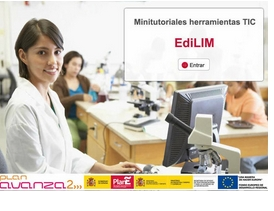
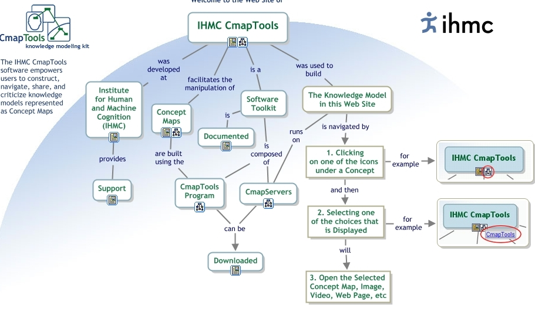

# Herramientas de autor

El paso de usuario a creador de actividades ni es obligatorio ni es necesario darlo al principio, el uso de los interesantes programas de autor ha de surgir siempre de la necesidad personal, tras conocer y valorar ejemplos elaborados por otros docentes. Si decidimos optar por esta línea, tampoco es conveniente trabajar con demasiados programas que hacen lo mismo; vistos los ejemplos, conviene que nos centremos en uno de ellos, el que nos parezca más sencillo o aporte más a nuestras necesidades.

Comenzar a trabajar con estas herramientas se hace más llevadero en grupo, en el caso de que un centro o un grupo decida constituir un seminario para confeccionar este tipo de actividades será necesario establecer la coordinación necesaria entre el profesorado de un mismo curso para evitar la monotonía derivada del uso reiterado y en distintas áreas de cuestionarios y más cuestionarios. Esta consideración vale para cualquier otra propuesta, soportar durante toda la mañana una presentación de diapositivas por cada asignatura resulta tan poco motivador como aguantar una conferencia magistral de 55 minutos cada hora a lo largo de un viernes lectivo. Sin embargo es innegable su aportación a la diversificación curricular, para realizar actividades de refuerzo, ampliación, apoyo...

Pese a mis reparos, y con el compromiso por parte de quien participa en este curso para no hacer un uso abusivo de ellos, he aquí una lista de programas de autor que permiten realizar cuestionarios y test para resolver en línea:

- [Hot Potatoes](http://platea.pntic.mec.es/~iali/CN/Hot_Potatoes/intro.htm) [(Ejemplo ►](http://www.juntadeandalucia.es/averroes/torredelprado/ingles/index.htm))
- [Cuadernia (Ejemplo ►).](http://cuadernia.educa.jccm.es/)
- [JClic](http://clic.xtec.cat/es/jclic/index.htm) [(Ejemplo►](http://clic.xtec.cat/db/jclicApplet.jsp?project=http://clic.xtec.cat/projects/plasgeo1/jclic/plasgeo1.jclic.zip&amp;lang=es&amp;title=Plasgeo+1)).
- [Ardora](http://webardora.net/index_cas.htm) [(Ejemplo ►](http://angarmegia.com/vidaprehistoria1.htm)).
- [Cuestionarios ](http://www.catedu.es/arablogs/blog.php?id_blog=1145&amp;id_articulo=44038)realizados con servicios web 2.0 que ofrecen sencillez y rapidez además de la posibilidad de embeberlos en nuestras wikis o blogs.
- En  principio puede parecer que **las líneas del tiempo** son unas herramientas ideales para Historia, y así es, pero su aplicación va mucho más allá: podríamos decir que se trata de unas herramientas ideales para las historias, pues cualquier proceso que tenga un desarrollo cronológico cabe en una línea del tiempo. De esta forma puede representarse una narración literaria, el crecimiento de una planta desde que sembramos la semilla en una maceta, el proceso para crear un puente levadizo con poleas en clase de tecnología, la excursión a Zaragoza…
* Son muchos los servicios que prestan su arquitectura para elaborar líneas del tiempo. Proporcionamos un [Tutorial de TimeRime](http://facilytic.catedu.es/wp-content/uploads/2013/10/Tutorial-TimeRime.pdf)

 

Otros Minitutoriales sobre sus posibilidades:

- [Presentación](http://www.aularagon.org/Files/UserFiles/File/Internet_aula/INF_COMUNICACION/Tutoriales/edilim_demo/edilim_demo.htm)
- [Obtención e instalación](http://www.aularagon.org/Files/UserFiles/File/Internet_aula/INF_COMUNICACION/Tutoriales/OIedilim/OIedilim_demo.htm).
- [Crear un Libro](http://www.aularagon.org/Files/UserFiles/File/Internet_aula/INF_COMUNICACION/Tutoriales/edilim_crear_libro/edilim_crear_libro_demo.htm).
- [Crear actividad de clasificación](http://www.aularagon.org/Files/UserFiles/File/Internet_aula/INF_COMUNICACION/Tutoriales/edilimclasifica/edilimclasifica_demo.htm).
- [Actividad de escoger imágenes](http://www.aularagon.org/Files/UserFiles/File/Internet_aula/INF_COMUNICACION/Tutoriales/edilimEscoger_demo/edilimEscoger_demo.htm).
- [Actividad tipo ](http://www.aularagon.org/Files/UserFiles/File/Internet_aula/INF_COMUNICACION/Tutoriales/edilimEtiquetas_demo/edilimEtiquetas_demo.htm)**[etiquetas](http://www.aularagon.org/Files/UserFiles/File/Internet_aula/INF_COMUNICACION/Tutoriales/edilimEtiquetas_demo/edilimEtiquetas_demo.htm).**
- [Crear una galería de imágenes](http://www.aularagon.org/Files/UserFiles/File/Internet_aula/INF_COMUNICACION/Tutoriales/edilimGaleria/edilimGaleria_demo.htm).
- [Crear galería de sonidos](http://www.aularagon.org/Files/UserFiles/File/Internet_aula/INF_COMUNICACION/Tutoriales/edilimGaleriasSonido_demo/edilimGaleriasSonido_demo.htm).
- [Actividad de mover imágenes](http://www.aularagon.org/Files/UserFiles/File/Internet_aula/INF_COMUNICACION/Tutoriales/edilimMoverImagenes_demo/edilimMoverImagenes_demo.htm).
- [Crear un panel](http://www.aularagon.org/Files/UserFiles/File/Internet_aula/INF_COMUNICACION/Tutoriales/edilimpanel_demo/edilimpanel_demo.htm).
- [Actividades de parejas](http://www.aularagon.org/Files/UserFiles/File/Internet_aula/INF_COMUNICACION/Tutoriales/edilimparejas/edilimparejas_demo.htm).
- [Crear Puzzle](http://www.aularagon.org/Files/UserFiles/File/Internet_aula/INF_COMUNICACION/Tutoriales/edilimpuzzle/edilimpuzzle_demo.htm).

Realizar preguntas sobre la explicación es una actividad habitual en el aula con la que seguiremos aunque utilicemos la pizarra digital interactiva; los alumnos, como siempre, pueden responder levantando la mano, desde su mesa; también puede salir a la pizarra, tomar la tiza digital y realizar las explicaciones oportunas; del mismo modo es posible, como veremos más adelante, que responda desde su propio ordenador, ya que podemos administrar un visor que muestre en la pizarra las pantallas de nuestros alumnos.

También es habitual ir realizando un esquema en el encerado; lo mismo puede ocurrir en nuestra pizarra interactiva en la que, no sólo podemos realizarlo manualmente, sino que es posible utilizar alguna de las herramientas web 2.0 que están disponibles (con la ventaja de que nuestro esquema gozará de la interactividad que permita la herramienta y de la que nosotros le sepamos o queramos dotar). Lo bueno es que nuestros alumnos pueden llevarse la pizarra a casa, obteniendo una imagen del esquema, problema si es manuscrito... o accediendo a la dirección del servicio que hemos usado para hacerlo. La mayoría de estos servicios permiten interactividad, bien por invitación bien por registro de alta, por lo tanto, y esto es lo mejor, nuestros alumnos pueden colaborar con nosotros y entre si a la hora de realizarlo a la vez que en la pizarra proyectada se va viendo el resultado final.er levantando la mano, desde su mesa; también puede salir a la pizarra, tomar la tiza digital y realizar las explicaciones oportunas; del mismo modo es posible, como veremos más adelante, que responda desde su propio ordenador, ya que podemos administrar un visor que muestre en la pizarra las pantallas de nuestros alumnos.

- Algunos como [CPMAP ](http://cmap.ihmc.us/conceptmap.html)o [FREE MIND](http://freemind.sourceforge.net/wiki/index.php/Main_Page) es necesario descargarlos y son muy conocidos entre el profesorado. Otros son muy sencillos de manejar, como [Kidspiration](http://cf.inspiration.com/espanol/index.cfm?fuseaction=products.kidspiration) y pese a que su web dice que está indicado para alumnos hasta 10 años, lo han utilizado alumnos y docentes de secundaria con éxito.

 

La web Cuaderno intercultural, dispone de un apartado específico con una amplia recopilación de enlaces a generadores online de material educativo. Los enlaces están bien clasificados en apartados como generadores de publicaciones, webquest, formularios, vídeos, cómics y hasta un total de quince bloques.

Dentro de cada uno de ellos, los enlaces están comentados de manera que no es preciso acceder a las decenas de webs recomendadas sino que ya desde el índice podremos hacernos una idea de las que nos pueden interesar.

Otros son servicios on-line que puedes conocer  realizados con algunas de estas herramientas que se muestran en el contenido de este curso.

 

