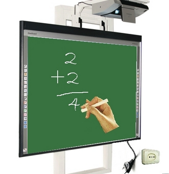

# MÓDULO 2. Una pizarra... ¿diferente?

La PDI se ha convertido en una herramienta muy presente dentro de las aulas. Al principio fue acogida con ansiedad e ilusión por unos, otros se la han encontrado sin más, el primer día de clase colgada en su aula. De cualquier forma tenemos ante nosotros una herramienta con gran potencialidad tanto en la comunicación como en sus posibilidades docentes. Pero... ¿cómo sé si la uso adecuadamente? ¿cómo empiezo a trabajar con ella? Seguramente deberé ser un experto informático....

En primer lugar no todo o que se cuenta es cierto....

2.1:De J.R. Olalla para el curso de Aularagon "Escuela 2.0"

## Reflexión

Algunas "Leyendas urbanas" sobre la PDI

(Extracto del artículo de Salvador Llopis el día 08/11/2011 en [Educ@conTIC](http://www.educacontic.es/))

- **Ahorra trabajo**.
- **Es fácil crear actividades**.
- **Cuanto más profesionales (técnicamente) son los contenidos mejor aprenderán los alumnos.**
- **Sirve igual para secundaria que para primaria.**
- **Con la pizarra los alumnos aprenden más.**
- **La PDI motiva a los alumnos.**
- **Con una PDI el profesor sobra.**
- **Con una PDI ya soy un profesor 2.0.**

Seguramente habrás oído algunas frases como éstas en charlas, ponencias o cursos, que presentan la Pizarra Digital Interactiva como la panacea educativa que va a solucionarlo todo.

¿Cuál es tu opinión sobre ellas?

<input class="feedbackbutton" name="toggle-feedback-24_9" onclick="$exe.toggleFeedback(this,true);return false" type="button" value="Mostrar retroalimentación"/>

### Retroalimentación

El autor opina:

**Ahorra trabajo**. Todo cambio exige trabajo pero no tanto como pueda parecer. La ventaja es que con un mínimo tiempo dedicado al principio, partiremos de una base para que en el futuro solamente actualicemos de forma sencilla los contenidos o actividades creadas.

**Es fácil crear actividades**. Es fácil si las actividades son sencillas o precocinadas y no tenemos muchas pretensiones (más que suficiente en ocasiones). Crear buenas actividades de aspecto profesional, es un trabajo que necesita tiempo y experiencia. Muy recomendable el trabajo entre distintos especialistas en los que cada uno aporte aquello que más conoce y por lo tanto menos trabajo les cuesta. Empezar por poco e ir avanzando.

**Cuanto más profesionales (técnicamente) son los contenidos mejor aprenderán los alumnos.** No es así, la calidad visual, animaciones, flash y demás artificios pueden ser un atractivo ficticio. Lo más eficiente suele ser una combinación equilibrada de sencillez, contextualización de la actividad en la clase, claridad de contenidos y diseño gráfico ligero.

**Sirve igual para secundaria que para primaria.** En algunos casos no es cierto. Además del tema de la altura física que puede hacer aconsejable un soporte de altura regulable. En cuanto a su uso en el aula, en primaria el nivel de participación del alumnado es mayor y en secundaria lo superará la exposición de contenidos (cuestión de tiempo y currículo con la que no estoy de acuerdo).

**Con la pizarra los alumnos aprenden más.** No está demostrado, como no lo está que aprendan más con las TIC. Es cierto es que la herramienta es cercana a los alumnos y pueden enfocar todo su interés en el ejercicio, pero es necesario mejorar en aspectos como la evaluación, la metodología, etc.

**La PDI motiva a los alumnos.** Realmente lo que les motiva es lo que hagamos con ella. Los alumnos están más cerca de su mundo de pantallas botones y pantallas, por lo que nuestras clases ganarán credibilidad como algo que existe de verdad y no son cosas del pasado que no les interesa aprender.

**Con una PDI el profesor sobra.** En algún momento habréis oído, que si se utiliza una PDI el profesor lo tendrá todo hecho. No voy a insistir en el papel del nuevo profesor, pero si nos hemos quitado el escribir largos textos con letra redondilla, dibujar complicados diagramas con tiza de colores y hacerlos desaparecer debajo de un taco de fieltro, nos habremos evitado el trabajo "sucio". Así nos quedará tiempo para otras actitudes más "2.0"

**Con una PDI ya soy un profesor 2.0.** Para sufrir "dosceritis" hace falta algo más. Seremos un profesor 2.0 si nuestra actitud y nuestras prácticas en el aula lo son, Néstor Alonso lo explica mejor que nadie en este [gráfico](http://www.flickr.com/photos/nestoralonso/5264656126/). Con una PDI únicamente seremos profesores con mucha suerte y una fantástica herramienta en nuestra aula para el aprendizaje.

## Objetivos

En este apartado enumeraremos la lista de objetivos a alcanzar.

- Aproximarse al concepto de Pizarra Digital Interactiva.
- Conocer su instalación básica.
- Reflexionar sobre sus posibilidades.
- Descubrir las posibilidades didácticas de la PDI sin conocer ningún software específico.
- Trabajar con algunos programas que permiten iniciarse en el trabajo con la PDI en el aula.

## ParaSaberMas

Vamos a utilizar un "**BLOG de Clase**" ( Ver "ANTES DE NADA! del Módulo 1 en Tareas) donde iremos colocando algunas de las actividades que realicéis.

Podría parece un contenido no propio de este curso, aunque su potencial para trabajarlo en el aula con la PDI es enorme y, precisamente lo vamos a usar para que, en el caso de que todavía no lo conozcas, descubras sus posibilidades educativas y de participación.

Utilizaremos un Blog de Arablogs, así que si no estás familiarizad@ con su manejo, aquí tienes [este artículo](http://www.catedu.es/facilytic/2013/10/16/manuales-y-tutoriales-de-arablogs/) de la página FacilyTIC, que incluye un pequeño manual.

