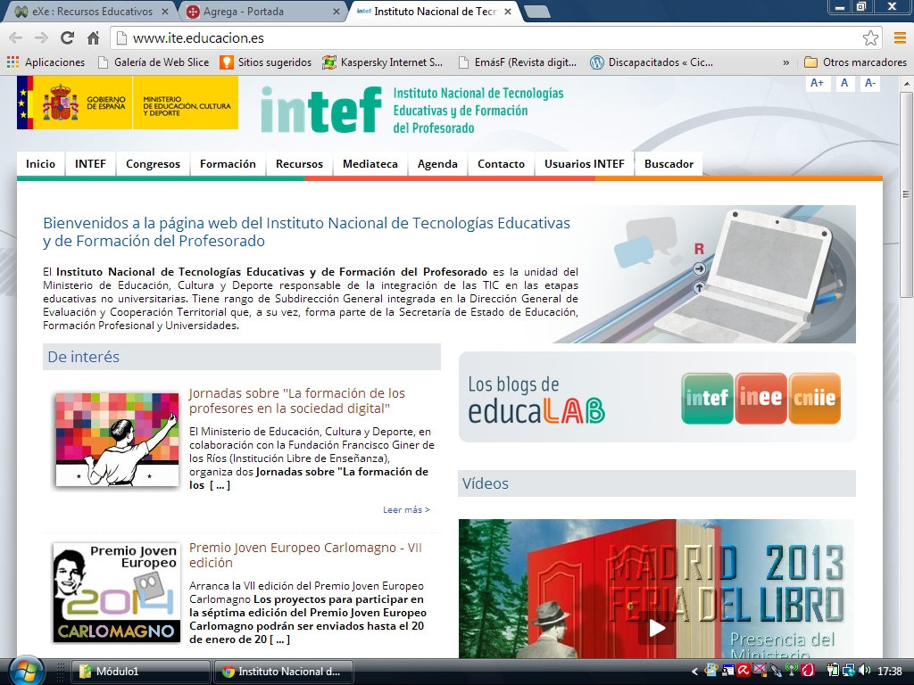

# Módulo3. Materiales Curriculares

## Objetivos

Los objetivos que vamos a alcanzar en este módulo son los siguientes:

1.Conocer los principales materiales curriculares como base para la mejora docente.

2. Identificar y clasificar los diferentes materiales en función de nuestras necesidades.

3. Aplicar dichos materiales al desarrollo de nuestras sesiones en el aula.

Disponer de una buena cartera de materiales curriculares digitales es un buen punto de partida para comenzar, a partir de ellos podemos ir desarrollando nuestras clases de una forma diferente, incorporando materiales en la red para completar las explicaciones y facilitar nuevos recursos al alumnado.

**Materiales del [INTEF](http://www.ite.educacion.es/es/intef)**

**Materiales de [CATEDU](http://facilitamos.catedu.es/)**
