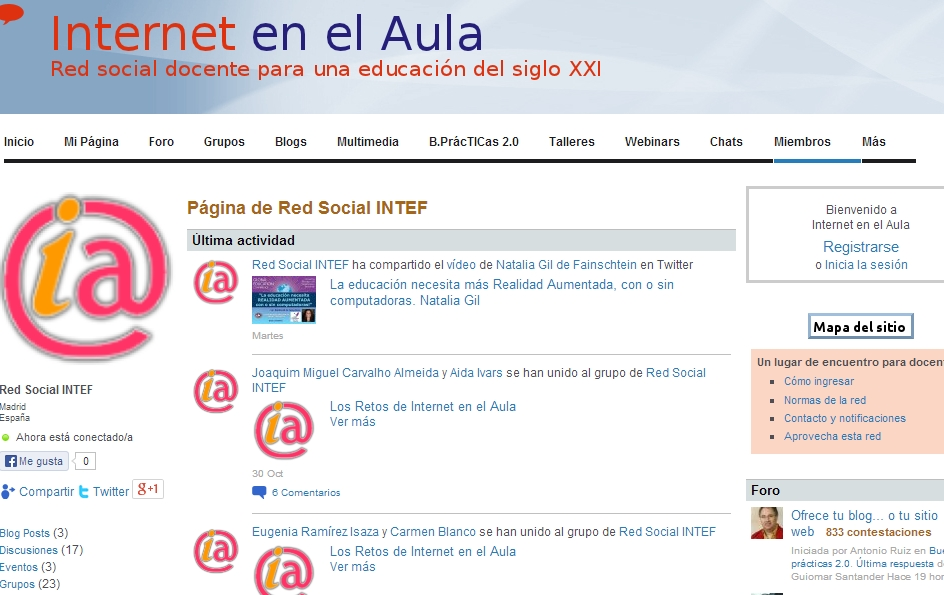

# MÓDULO 7: INTERNET EN EL AULA

La disponibilidad de Internet en el aula aporta una potente herramienta didáctica que provoca tantas esperanzas pedagógicas como recelos. Disponer de un medio con tanta información a la distancia de un clic pone a disposición de nuestros alumnos y de nosotros mismos una biblioteca universal. No sé si alguna vez se acabará el libro impreso (aunque a estas alturas las ediciones impresas de libros de texto –que no de consulta– tendrían que ser una especie en vías de extinción sin protección alguna) lo que sí tengo claro es que la lectura y la escritura en pantalla serán, a lo largo del siglo XXI, la forma más habitual de leer y escribir. Buena parte de la cultura escrita está en las bibliotecas, es cierto, pero no lo es menos que buena parte de la cultura escrita también está en Internet y no sólo eso, todas las nuevas formas de cultura escrita que han nacido desde finales del siglo XX y seguirán apareciendo en el futuro están antes la red que en las bibliotecas. 

Hay muchos literatos, investigadores, científicos, filósofos... desconocidos publicando en el ciberespacio, pero cada día son más los creadores conocidos que publican sus obras en la Web. La aparición de algunos libros completos y de muchos primeros capítulos que las editoriales o los propios autores proporcionan a los lectores para promocionar las ediciones, están cambiando la forma de leer y la de elegir libros y crea un desasosiego inquietante entre los que gustamos de tocarlos y tememos su desaparición paulatina. Pero paralelamente surgen movimientos de intercambio de libros físicos entre personas desconocidas, ediciones digitales, piratas o legales, se mueven constantemente por la red y fenómenos como el Book Crossing (dejar libros en lugares determinados para que otras personas los encuentren y los lean), que convierten nuestras ciudades en bibliotecas urbanas, serían imposibles sin la existencia de Internet y están adquiriendo tanta importancia que no sería descabellado convertir los espacios escolares en ámbitos de aprendizaje de esta práctica.

Nuestros alumnos y nuestras alumnas, como el resto de la sociedad, también los y las docentes, empleamos menos que antes las enciclopedias y los libros de consulta. Navegamos por las estanterías del ciberespacio para buscar información, antes de buscarla en las fuentes tradicionales, incluso, si no la encontramos, buscamos las fuentes tradicionales también a través de Internet.

 

## Objetivos

Los objetivos a conseguir en este Módulo son los siguientes:

1. Conocer las posibilidades didácticas que internet nos supone dentro de nuestras clases.

2. Identificar  y  enseñar a gestionar esta potente herramienta.

3. Dar a conocer los posibles riesgos de la inmediatez de la información de nuestros alumnos.

4. Utilizar internet como medio de comunicación alternativo.

5. Compartir conocimientos y contenidos a través de la red.

