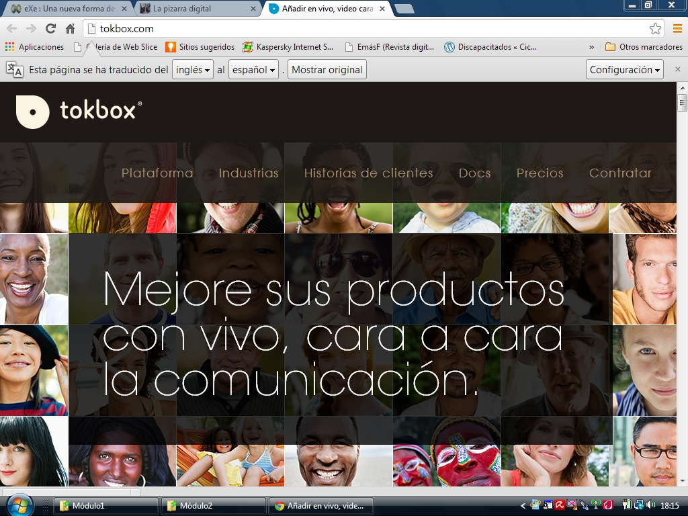

# Módulo 8: UN AULA ABIERTA AL MUNDO

## Conocimiento previo

Las aulas abiertas son el último paso de este recorrido que comenzamos utilizando las pizarras digitales interactivas como medio de explicación del profesor, se trata de un camino más o menos largo, dependiendo del punto de partida, y más o menos rápido, según la facilidad de cada uno para recorrer etapas. Si estamos decididos a integrar las TIC en el aula, no solo como una herramienta más, sino como soporte de una metodología innovadora, cambiar los muros por paredes transparentes en nuestras aulas es el punto de llegada natural marcado en nuestra hoja de ruta.

Existen muchas formas de trabajo que permiten que las aulas salgan al exterior, una videoconferencia con otro centro con el que compartimos un comenius, por ejemplo, si no es un hecho aislado y se convierte en una dinámica de trabajo habitual para intercambiar aportaciones con nuestra contraparte puede abrirnos las fronteras. Además de los medios habituales para hacerlo, como los messenger de hotmail o yahoo, skipe o google, existen servicios en páginas web que nos permiten comunicaciones multilaterales como [tokbox](http://www.tokbox.com/) (ahora Open Tok) donde basta con que alguien esté dado de alta e invite a los demás para juntar un grupo de aulas.

 

## Objetivos

Los principales objetivos a conseguir en este módulo son:

1. Conocer las diferentes formas de sacar el aula al "exterior".
2. Integrar las metodologías y herramientas a utilizar propias de las TIC de este módulo: Web, wikis, Blog,.. en el día a día de nuestra trabajo de aula.
3. Fomentar la participación activa de nuestro alumnado en dichas tareas.

