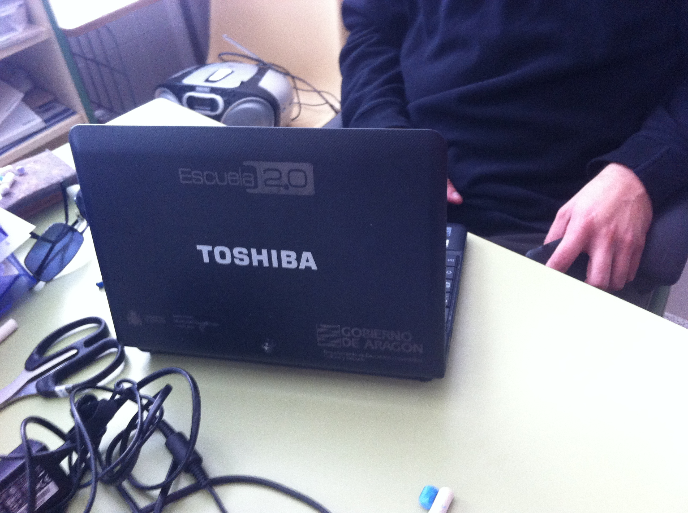

# MINI-TABLETS

**Un cambio en la tecnología**

Hace tiempo que en los cursos de formación del profesorado en TCI no hablamos de **hardware **y **software**, tal vez sea el momento de volver a hacerlo: la capacidad de los equipos informáticos ha crecido de forma exponencial: procesadores muy potentes con doble **corazón**; mayor disponibilidad de la memoria RAM, que ha cambiado el Mb por el Gb como estándar de medida; enormes discos duros... Los portátiles han mejorado sus prestaciones y disminuido su precio de forma que ahora pueden salir más baratos que los sobremesa. A la vez, los nuevos sistemas operativos comerciales y no comerciales requieren más recursos y, por tanto, nuevas mejoras en el rendimiento de los equipos. Hemos llenado nuestros discos duros de programas mastodónticos y profesionales (siempre la última versión, por favor) para realizar actividades educativas cotidianas como escribir documentos, realizar algún cálculo y, en el mejor de los casos, preparar alguna presentación con inserción de imágenes... Si repasamos el currículo de la asignatura optativa en Bachillerato **Tecnologías de la información y de la comunicación** nos podemos dar cuenta de qué se pretende al finalizar las enseñanzas medias superiores en cuanto al manejo de ordenadores: **la formación de usuarios**.

La web 2.0 cambia el panorama descrito: los servicios y las herramientas están en la red (no en el disco duro), los contenidos se construyen entre todos on-line (tampoco en el disco duro), por lo tanto tendremos que ir cambiando nuestra manera de concebir la máquina que nos permite trabajar en este nuevo entorno:
- un equipo (sobremesa, portátil, táblet, minipc, tableta, smartphomne y lo que salga al mercado),
- dotado de un sistema operativo, (windows, linux, OS o android y los que vengan)
- un software básico que permita realizar acciones de usuario elementales,
- capaz de conectarse a internet de forma inalámbrica,
- con un navegador web y sus complementos necesarios (java, lector de pdf, reproductor de flash...)
- un antivirus sencillo que permita la navegación segura
- un dispositivo (interno, externo o en la nube) de almacenamiento capaz de guardar trabajos (no los 194 minutos de Titanic)
- lo más portable posible...
- y poco más. 

**Los ordenadores de alumno.**

- La disponibilidad de equipos es, por tanto, muy alta, a los tradicionales sobremesa o portátiles, se unen en muchos centros táblets, minipcs we, incluso, tabletas (del centro o, por qué no, del alumno) y smartphones, que abren un amplísimo campo en la integración de medios conectables en el aula.

 

El equipamiento más reciente son los **minis**, y aunque los modelos irán variando, estas son algunas de sus características básicas:

- Ordenador ultraportátil de bajo peso (1-1,5 kg), con pantalla con un tamaño mínimo de 10 pulgadas y resolución mínima 1024x600 píxeles.
- Dotado de un procesador de bajo consumo, con una frecuencia de al menos 1GHz, memoria de al menos 1 Gbyte y disco duro con una capacidad mínima de 60 Gbytes.
- Con batería de alta capacidad, que permita un uso continuado sin recarga de al menos 4 horas, así como de fuente de alimentación externa.
- Conectividad tanto para red de área local como para red inalámbrica.

**Asignación de los equipos**
Es imprescindible realizar una reflexión muy profunda acerca de la distribución y asignación de los equipos informáticos en los centros. El modelo aula de informática parece ya superado en cuanto a los equipos de sobremesa, aunque perviven algunas tienen que ser una especie a extinguir y sin posibilidad alguna de recuperación Los ordenadores tienen que estar en las aulas y distribuir los ordenadores fijos por las aulas es la mejor decisión que puede adoptarse. ¿En cuáles? en aquellas donde el alumnado no disponga de dispositivos portátiles. ¿Cuántos? Tres, cuatro, los que sean posibles para facilitar a los alumnos su manejo.

Repartir los dispositivos portátiles tampoco es tarea fácil. El hábito dice que los de quinto y sexto de primaria o algunos grupos de secundaria disponen de ordenadores individuales, pero pueden pensarse otros modelos. ¿Cuáles de estos alumnos disponen de ordenador en casa? ¿Tiene sentido que se los lleven cuando hay otros alumnos que no tienen equipos en sus domicilios? ¿Puede hacerse otro reparto que garantice que todo el alumnado del centro tenga acceso?

Es preciso elegir y revisar el modelo en cada curso escolar para adaptarlo a la disponibilidad de equipos y al acceso que el alumnado tiene a los medios informáticos. En cualquier caso, es preciso reflejar esa asignación en los documentos TIC del centro:

- Se trata de un paso previo a su entrega a los alumnos para el uso en el aula, los técnicos procederán a normalizarlos y realizar el proceso para su conexión a la red, configurando cada equipo con un nombre fijo.
- Finalizado este proceso **el centro cumplimentará un Documento-Tipo **para la Distribución de miniportátiles (o de táblets) en el que se relacionan, por grupos de alumnos, la marca y modelo del ordenador, el nombre del equipo y el alumno al que se le entrega (o alumnos que lo comparten), que deberá ser custodiado en la secretaría del centro y se actualizará en cada curso académico.
- **Independientemente** **de este documento**, el propio centro comprobará y actualizará periódicamente su inventario en la aplicación de **[gestión del Programa Ramón y Cajal](http://www.catedu.es/inventario)**. Este control afectará, además de a los equipos de alumno, a los destinados para uso del profesorado, así como al resto de la dotación del programa.
- Cada equipo se identificará mediante una **pegatina,** tanto en su carcasa como en el maletín. En esta etiqueta deberá figurar, como mínimo, el nombre del equipo y el del centro y puede incorporar otros datos como el número y nombre del alumno...

**Normalización común**

- Los equipos estarán configurados mediante una normalización común para todos los centros de la comunidad autónoma de Aragón que, atendiendo a la experiencia de uso, procurará la máxima operatividad.
- La normalización será coordinada desde los servicios centrales del Departamento de Educación al comienzo de cada curso escolar. Los equipos nuevos que lleguen al centro ya llevarán instalada esta normalización.
- De esta normalización común existirá una copia en soporte físico. Cuando un equipo sufra una desconfiguración de software, se podrá volcar de nuevo para recuperarlo. A continuación será necesario individualizarlo añadiéndole de nuevo su nombre. El proceso se simplificará al máximo para que pueda realizarse sin problemas en el propio centro para lo que existen unos USB de normalización..
- Para evitar que en esta nueva normalización se pierdan los documentos y el trabajo realizado por el alumno, el instituto arbitrará las medidas oportunas de copias de seguridad a través de la ****intranet ****u otros medios que considere oportunos.
- Cualquier variación de esta normalización, mediante el añadido de software desde el propio centro, no afectará a la imagen estandarizada y, en consecuencia, en el supuesto de que un equipo tenga que ser restaurado por los técnicos del Departamento de Educación recibirá la normalización inicial.
- Es muy aconsejable, teniendo en cuenta las características de los miniportátiles, evitar la instalación de software diferente al de la normalización. Una carga excesiva de aplicaciones ralentizaría el funcionamiento del ordenador haciéndolo inoperante. Para el supuesto de que algún profesor desee la instalación de programas no previstos en la normalización básica, el propio centro deberá controlar el proceso a través de un protocolo establecido.

