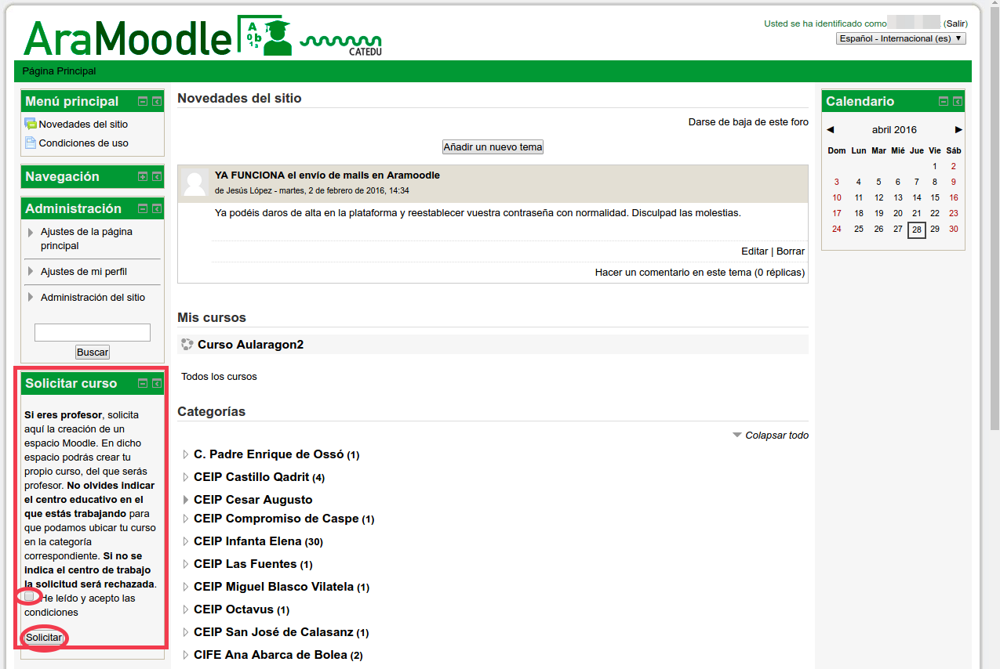



CATEDU ofrece [Aramoodle](http://catedu.aragon.es/moodle/?lang=es) para que el profesorado lo utilice con sus alumnos. Para darte de alta en Aramoodle solo tienes que registrarte. Para ello sigue las instrucciones que aparecen en la parte derecha de al pantalla que te muestra el siguiente enlace: http://catedu.aragon.es/moodle/login/index.php , y ahí pulsa en el boton: "Crear nueva cuenta"

Si quieres crear un curso, una vez registrado debes acceder a ella y solicitar los cursos que necesites. No olvides indicar en la solicitud el centro educativo en el que trabajas para que podamos ubicarlo correctamente, si tu centro educativo no aparece en el desplegable del campo Categoría, indícanos cual es en el campo "Razón para solicitar el curso", y nosotros crearemos la categoría.

**La propia plataforma en la que estás haciendo las tareas de este curso es una instalación de Moodle**

Puedes acceder los contenidos del curso de [CATEDU sobre Moodle](https://catedu.github.io/curso-moodle/).