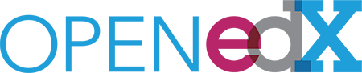

# Open edX

EdX es una iniciativa en línea sin ánimo de lucro creada por los socios fundadores de Harvard y MIT y compuesta por docenas de instituciones líderes mundiales, el xConsortium. EdX ofrece cursos interactivos en línea y MOOC de las mejores universidades e instituciones del mundo.

Open edX es la plataforma de código abierto que impulsa los cursos de edX. A través de su compromiso con la visión de código abierto, el código edX está disponible gratuitamente para la comunidad. Las instituciones pueden alojar sus propias instancias de Open edX y ofrecer sus propias clases. Los educadores pueden ampliar la plataforma para crear herramientas de aprendizaje que satisfagan sus necesidades con precisión. Y los desarrolladores pueden contribuir con nuevas características a la plataforma Open edX.

Su objetivo es construir una próspera comunidad mundial de educadores y tecnólogos que comparten soluciones innovadoras para beneficiar a los estudiantes de todo el mundo. Te invitamos a explorar Open edX y participar en nuestro creciente movimiento.

_Texto extraído de _[https://open.edx.org/about-open-edx](https://open.edx.org/about-open-edx)

> **tip**
>
> ### Pero entonces... ¿Cuál utilizo, Open edX o Moodle?
>
> Aquí tienes un [artículo](http://blog.educalab.es/intef/2016/01/28/analizamos-dos-evas-gratuitos-moodle-vs-open-edx/) interesante al respecto.

