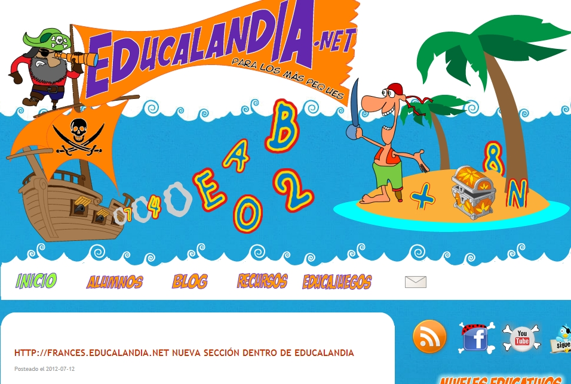
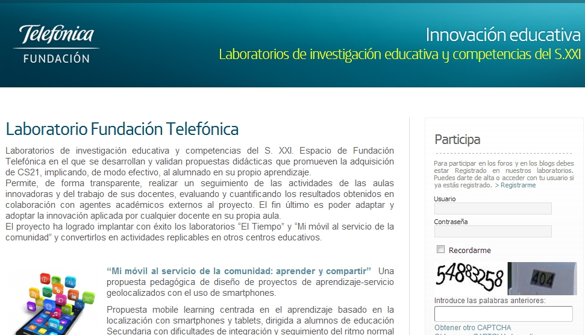
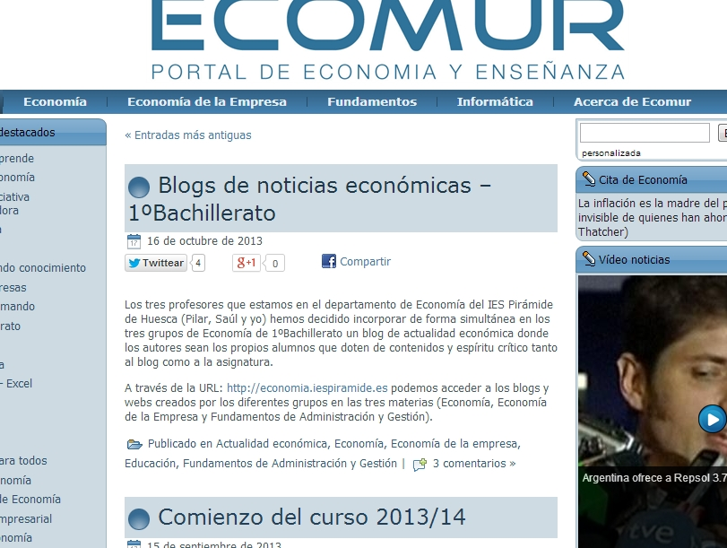

# Para saber más... Actividades de ampliación

## ParaSaberMas

Seguro que buscando en Internet encuentras muchas más posibilidades, lo que aquí proponemos son algunos ejemplos temáticos seleccionados, cuando nos ha sido posible, con un criterio de proximidad, ya que están realizados en nuestra Comunidad Autónoma, por eso habrá más de unas áreas que de otras. Este criterio de cercanía nos pone en contacto con el trabajo de otros compañeros, del centro de al lado, a los que a lo mejor conocemos, lo que nos da una perspectiva real de lo que se puede conseguir. Por eso no están todas las áreas, lo sentimos.

**Infantil:**

- [La PDI en Infantil](http://roble.pntic.mec.es/jprp0006/lectura_digital/22_la_pdi_en_infantil.html)
- [75 unidades didáctias interactivas para educación infantil](http://www.orientacionandujar.es/2010/08/20/75-unidades-didacticas-infantil-interactivas-y-para-pdi/)
- [Nuestra amiga la PDI](http://ciberespiral.org/bits/21/nuestra-amiga-la-pdi-en-el-aula-de-infantil/):

**Primaria:**

- [Escuela 2.0 primaria](http://www.catedu.es/Escuela20_Primaria/)
- [Recursos favoritos para PDI](http://www.mister-wong.es/user/RecursosPrimaria/pdi/)
- Curalia (fundación telefónica) [Guías T-Pak](http://curalia.fundaciontelefonica.com/grupos/guias-metodologicas-tpack-areas-instrumentales-para-primaria-y-secundaria/guias/):

**Lengua y literatura:**

- Abrapalabra [►](http://abrapalabra.catedu.es)
- Escena (recursos relacionados con el teatro) [►](http://escena.catedu.es)

**Ciencias Sociales:**

- La ciudad (Geografía ESO) [►](http://materialesccss.catedu.es)
- Aragón romano [►](http://aragonromano.catedu.es)
- El territorio [►](http://el_paisaje.catedu.es)
- ARTECREHA [►](http://www.artecreha.com/)
- Cuadernos de Campo [►](http://cuaderno_campo.catedu.es)

**Ciencias, Física y Química:**

- Cienciaragón [►](http://cienciaragon.catedu.es)
- Las mil caras de la Ciencia [►](http://www.lasmilcarasdelaciencia.com/)

**Tecnología:**

- Aratecno [►](http://catedu.es/aratecno/)

**Matemáticas:**

- Matemáticas en tu mundo [►](http://matematicas_mundo.catedu.es)
- Matemática vital [►](http://matematicavital.com/)
- Calendas [►](http://calendas.catedu.es)

**Economía**:

- Ecomur [►](http://www.ecomur.com/)

**Transversales:**

- Portal de convivencia en Aragón [►](http://convivencia.catedu.es/)
- Escuela aragonesa de consumo [►](http://consumo.catedu.es)Prevención de drogodependencias [►](http://drogodependencias.catedu.es)

**Filosofía:**

- Filosofiartes [►](http://filosofiartes.catedu.es)

