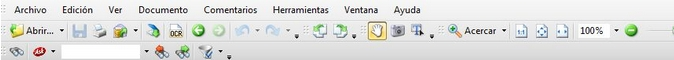
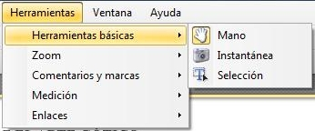
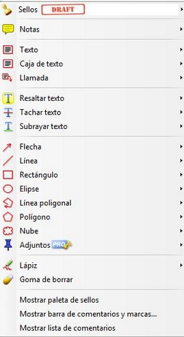
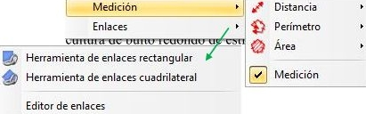
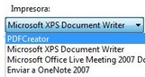
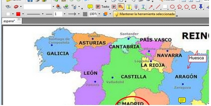

# PDF-XChange Viewer

En este apartado vamos a conocer un programa específico que nos va a permitir buscar soluciones con un tipo de formato común muy utilizado en nuestro día a día,como son los Documentos  en PDF . Pero... "el lector que tengo instalado no me permite interactuar con él, si no es con el software de la PDI", pues bien, esta afirmación no es del todo cierta. Entonces, ¿**Qué pasa con los PDF en mi PDI**?

Hay un lector de PDF, llamado **PDF-XChangeViewer**, que permite escribir y marcar sobre los     documentosPDF. Es totalmente gratis y se puede instalar de forma fija en tu ordenador (en algunos puede que esté instalado) o tenerlo en forma **portable** (es decir se ejecuta y no requiere instalación) que es como lo presentamos [(DESCARGAR AQUÍ)](https://portableapps.com/apps/office/pdf-xchange-portable). Bueno para ser exactos hay que decir que es gratuito en la versión que vamos a trabajar, tiene algunas funcionalidades (como unir o separar documentos PDF) que son **pro** y que sólo están activadas en la versión de pago.

Veamos lo que nos ofrece este programa:

Presenta una barra de herramientas (configurable desde **Ver &gt; Barra de Herramientas**) con gran cantidad de funcionalidades.

La mayor parte son comunes a muchos otros programas: Archivo, Edición, Ver , aunque en Archivo, cabe destacar que es desde donde abriremos el documento que queramos trabajar y también da la opción de exportar lo que hayamos realizado en (casi cualquier) formato de imagen.

### Herramientas

Especial interés tiene para nuestro propósito la pestaña **Herramientas**:

- Las Básicas:

Mano para mover el documento, además de ser "paso obligado" para dejar una herramienta y coger otra.

Instantánea que hace una captura rectangular de la zona que le marquemos (cuando sueltas el botón del ratón, se hace la foto).

Selección que permite seleccionar fragmentos de texto para copiarlos o simplemente marcarlos(esto no siempre es posible si el documento está protegido).

Otra de las herramientas de gran interés (puede que la que más para el trabajo con la PDI) es Comentarios y Marcas que permite:

- Añadir Sellos, que son unas imágenes predefinidas que podemos pegar en la parte del documento que queramos.

- Añadir Notas donde queramos del documento. El estilo se puede variar y funciona de forma muy sencilla: se coloca en el lugar deseado y se abre un cuadro de texto. Una ves colocado el comentario, se puede cerra el cuadro, pero queda el icono de la nota. Si se pulsa en el icono se abre el comentario.(con botón derecho se elimina)

- Añadir Texto, Caja de Texto y Llamada que permiten escribir en el PDF con el teclado. La primera opción escribe en una línea, la segunda es como el "cuado de texto" de word y la tercer es como la anterior pero con una flechita. Se puede editar el estilo, tamaño,...

- Resaltar, Tachar o Subrayar texto.

- Añadir un buen número de figuras: Flecha, Línea, Rectángulo,..... que se pueden editar en cuanto al color, grosor,... Todas ellas, al igual que los textos o los sellos, son considerados como imágenes por lo que para eliminarlas basta seleccionarlas con la Mano y con botón derecho Eliminar.

- Insertar anotaciones manuscritas con la herramienta Lápiz y eliminar las  mismas con la Goma de borrar.

- Las tres últimas opciones permite personalizar los Sellos y mostrar u ocultar las barras o listas que se indican.

Las herramientas de **Medición**, son especialmente interesantes para el trabajo geométrico y de planos o mapas. Se puede establecer la escala en que se realizan las mediciones.

Por último **Enlaces**, permite seleccionar un sector del documento y enlazarlo a otro PDF de este u otro documento, a un enlace en internet o a un archivo.

Así pues, como se deduce de todo ello, además de alguna otra potencialidad de este programa que lo convierte en mucho más que un simple lector de archivos PDF, PDF-XChange Viewer utilizado en la PDI, permite interactuar perfectamente con el documento, es más como permite guardar los cambios, el documento puede estar preparado previamente con enlaces, subrayados,... y todo lo que se considere.

# Tarea

VOLUNTARIA:

Piensa en las posibilidades que el programa ofrece y reflexiona sobre cómo lo podrías  utilizar con la PDI.

# Reflexión

Imagina que el documento sobre el que querrías interactuar no está en PDF. Es una lámina, una imagen, un documento en word,....

Supongamos esta imagen:

Sin conocer todavía el software propio de la PDI, ¿cómo podrías trabajar con ella en la pizarra interactiva?

Supón que te has acostumbrado a utilizar PDF-XChangeViewer y pretendes seguir usándolo.... ¿cómo lograrlo?

%accordion%Solución%accordion%

Las soluciones pueden ser múltiples pero te propongo usar otro programa gratuito: [PDF Creator](https://es.wikipedia.org/wiki/PDFCreator).

Este programa te permite convertir cualquier documento del tipo que sea en un PDF. Se instala como una impresora virtual, es decir que cuando abres el documento que quieres convertir y le das a la opción Imprimir, aparece como una de las impresoras que tienes instaladas, lo seleccionas y el resto es sencillo: un nombre y un lugar para guardarlo.

Convertido en PDF, ya puedo trabaja sobre él con el PDF-XChange Viewer:

Pruébalo con otros documentos!!!

%/accordion%
# Retroalimentación

