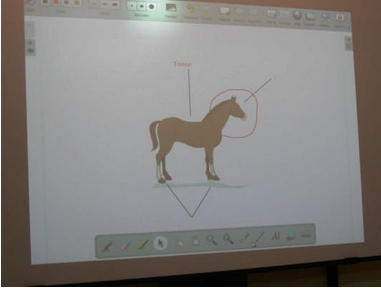

# PDI

**Concepto: **

La pizarra digital interactiva (PDI) es un conjunto de elementos (ordenador, vídeoproyector y la pizarra propiamente dicha con su dispositivo de escritura y puntero) que permite la proyección de contenidos digitales en una superficie interactiva para compartirlos en grupo.

El principal valor añadido de este sistema, con respecto a los que se habían venido utilizando (vídeoproyector y ordenador) es que podemos actuar sobre la propia superficie de proyección (similar a lo que se realizaba sobre la pantalla del táblet) y la ejecutamos en la pizarra propiamente dicha, lo que nos proporciona una mayor capacidad de actuación; además, en función del software instalado, disponemos de un escritorio accesible con herramientas y programas para poder pasar de uno a otro de forma más simplificada.

En todo caso se trata de:

- **Una pizarra conectada** que permite mostrar cualquier contenido que esté en Internet (páginas web, fotografías y fotomontajes o presentaciones; vídeos, animaciones infográficas o transmisiones en vivo; periódicos; mapas...)
- **Visualizador de documentos del ordenador** (de cualquier ordenador que esté en la red del centro, del aula, de los alumnos... si usamos las herramientas adecuadas que proporciona el programa): textos, hojas de cálculo, mapas, mapas conceptuales, presentaciones, gráficos...
- **El puntero de** **tinta digital **(o el dedo)permite escribir sobre la superficie de proyección y se utiliza, además, a modo de ratón.
- Lo que escribimos en la pizarra **se almacena en el ordenador** de forma que los alumnos pueden llevarse el contenido de la pizarra a casa.
- Resulta un gran apoyo pedagógico porque se puede aprender más y mejor:
	- Es una fuente de información inagotable y queda al alcance de un clic.
	- Permite una comunicación directa con el alumnado mediante su visualización, el envío de contenidos a los ordenadores de los alumnos a través de distintos canales (correo electrónico, ****intranet****...)
	- Facilita la interacción con el alumnado y entre el alumnado: sus aportaciones pueden verse en la pizarra utilizando el software adecuado (****VNCyteklo****, ****intranet****...).
	- Permite proporcionar materiales adecuados e individualizados para el alumnado (****intranet******, **pupitre****...)
	- Favorece la motivación, la comprensión, la participación realizando clases más activas, más atractivas, más multimedia...
	- Puede ser una herramienta que incite a renovar metodologías dependiendo de la predisposición del docente a hacerlo.
	- Las metodologías que derivan de su uso pueden facilitar el tratamiento de la diversidad, la cooperación en la realización de tareas...
	- Integra y hace presente el uso de las TIC en las actividades de aula, de forma que el centro está a la altura de la sociedad digital.
	- Su sencillo manejo puede ser un factor de motivación para el profesorado.

>**info**
># Reflexión
>
>**Sin comenzar a trabajar sobre las PDI que otras posibles ventajas puedes **apuntar** para el aprendizaje en el aula, anota ****algunas. Si quieres conocer las que propone un estudioso sobre el tema, haz clic aquí abajo.**
>
>%accordion%Solución%accordion%
>
>Mira lo que propone [Père Marqués](http://www.pangea.org/peremarques/):
>
>- Resulta más cómoda que la pizarra no interactiva (no es necesario recurrir al ratón ni el teclado) para interactuar con el software. Puede hacerse directamente sobre la pizarra.
>- La escritura directa sobre la gran pantalla táctil (pizarra) resulta especialmente útil para los alumnos con pocas habilidades psicomotrices, que se inician en la escritura y para estudiantes con N.E.E.
>- Los subrayados permiten destacar algunos aspectos importantes de las explicaciones de manera natural e inmediata.
>- Permite mantener más el contacto visual con el grupo de los estudiantes
>- El gran tamaño de la pantala táctil (pizarra) facilita la interacción con los programas: selección de opciones,..
>- Puede haber una triple interacción, por ejemplo: el profesor ante el ordenador, algunos alumnos ante la pizarra interactiva y el resto de la clase participando desde sus asientos bien mediante sus ordenadores, bien mediante intervenciones directas.
>
>%/accordion%

# Importante

**No olvides que la Pizarra Digital Interactiva no es más que un recurso, por sí sola no posee ningún valor didáctico.**
 

