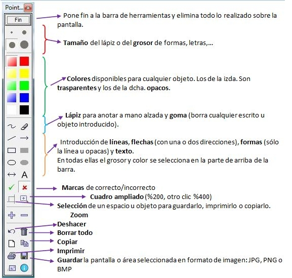
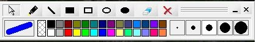

# Pointofix

##   Pointofix

1.18. Captura pantalla

Aunque no ofrece muchas prestaciones avanzadas si que puede ser un buen referente para empezar a trabajar de manera diferente con la PDI en el aula. Puede servir para perder el miedo y practicar desde cualquier PC ya que se puede llevar en el lápiz de memoria.

Página de referencia y ayuda:<a>http://www.pointofix.de/hilfe_es.php</a>

## Descarga del programa

Descarga versión portable en español:

<li>En la página [http://www.intercambiosvirtuales.org/portables/pointofix-multilenguaje-espanol-portable-realiza-anotaciones-sobre-su-escritorio](http://www.intercambiosvirtuales.org/portables/pointofix-multilenguaje-espanol-portable-realiza-anotaciones-sobre-su-escritorio)
<ul>
- Por ejemlo en el enlace de [MEGA ](https://mega.co.nz/#!0ZUQwRBQ!65qvMnPwR1JMdcY1ZgYoVnSYMClTyUj9G6mjzrtNAtU)se descarga un fichero zip cuya contraseña es** www.intercambiosvirtuales.org**

## ¿Cómo funciona?

¿Qué nos permite hacer?

Como se ha comentado,al activarlo, el programa presenta su **barra de herramientas** que se puede mover de posición (también aparece si está activado y damos con el botón derecho del ratón en cualquier punto de la pantalla).

1.21. Captura pantalla

Posibilidades que nos ofrece.

Ésto dependerá del estilo, área y nivel de cada cual, pero como se puede apreciar Pointofix nos ofrece múltiples posibilidades de forma muy intuitiva:

- Marcar sobre cualquier documento sin necesidad de modificar formato ni realizar ningún proceso de importación: acalraciones, correciones, subrayados,...

- Actuar sobre una proyección en curso.

- Añadir una hoja sobre la que aclarar, resumir, esquematizar,.... haciendo un paréntesis en la explicación.

- Ocultar lo que tenemos en la pantalla hasta que se considere oportuno (solución, propuesta,...).

- Guardar lo realizado en formato de imagen.

..... Y todo aquello que se te pueda ocurrir.

# ParaSaberMas

Un programa similar a Pointofix es **ScreenMarker**. [(descarga aquí)](http://www.screenmarker.com/)

Se trata de otro programa gratis y portable que es un poco más limitado que Pointofix, con una barra de herramientas más austera y sin traducción al castellano (está en ingés).

1.23. Captura pantalla

Su funcionamiento es similar. Una vez iniciado el programa, aparece esta barra de herramientas que permite, en este caso sólo dibujar o añadir formas, sobre la que haya en la pantalla.

Siendo consciente de sus limitaciones, es otra opción a tener en cuenta.

