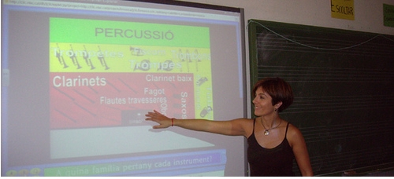

# SOFTWARE PDI

"Lo que nos funciona en el ordenador, nos funcionará en la PDI".

Esta afirmación tan simple es clave para lanzarnos al uso de la PDI en clase. Recuerda que si tenemos conectada la PDI y el Proyector como ya hemos visto, el puntero o el dedo, se convierten en el "ratón" que desde la superficie de la PDI nos permite manejar el ordenador.

¿Cuándo emplearla?

Cuando la interacción, que nos ofrece la PDI, facilite el aprendizaje de los contenidos tratados.

- Introducimos un tema (vídeo, presentación,....)
- Preparamos un esquema del tema.
- Ilustrar los conceptos(imágenes, láminas,..)
- Queremos que participe el alumnado (propuestas, actividades interactivas,...)
- Necesitamos centrar la atención del alumnado en un contenido(noticia, imagen para e debate,...)
- Nos interesa mostrar la información de forma gradual (con recursos de la pdi como el foco o la cortina)

 Nuestra metodología no va a cambiar de forma radical de un día para otro. La usaremos de forma gradual, ajustándonos a las necesidades del aula y a la seguridad que vayamos adquiriendo en su uso. Cada docente deberá decidir lo que hace con la PDI en su aula.

2.6.Licencia: [Algunos derechos reservados](http://creativecommons.org/licenses/by-sa/2.0/) por [luistorresotero](http://www.flickr.com/photos/67205343@N08/). En [http://www.flickr.com/photos/](http://www.flickr.com/photos/67205343@N08/6155171761/sizes/m/in/photostream/)

Algunas ideas:

- Uso SIN software específico de PDI:

-  Navegar por páginas web , bien estáticas o dinámicas, mapas interactivos...

- Visualizar documentos, (nos permite mantener el modelo viejo, estar de pie en la pizarra. No permite hacer anotaciones manuscritas). Puede tratarse de un texto, una presentación, un pdf, una imagen, un vídeo...

- Ejecutar de programas específicos de las distintas áreas: Kidspiration, ArtRage, ...

- Ejecutar  aplicaciones hechas con generadores de actividades tipo flash, javaclic, Ardora, Edilim, Hotpotatoes..

- Libros interactivos multimedia o libros digitales de diferentes editoriales.

- Hacer uso de la tinta digital, marcas, textos,.... con algunos programas habituales como: presentaciones realizadas con Power Point, PDF, programas propios del Tablet PC (Journal, ArtRage,...)

- Uso CON el software de la PDI:

Además de poder hacer lo mismo que sin él, nos ofrece la ventaja de tener herramientas activas que facilitan el trabajo.

- Uso de la pizarra blanca para escribir. No requiere el conocimiento a fondo del software:  sobre la marcha, se va escribiendo como en la pizarra tradicional.

- Hacer anotaciones sobre todo tipo de documentos (texto, presentaciones, hojas de cálculo, imágenes, vídeo...). Basta con abrir el documento desde el software de la pizarra. No permite modificar el original, pero sí escribir sobre él.

- Hacer anotaciones sobre un documento proyectado con una cámara web: libro, corregir ejercicios...

Todo ello, no se puede dejar al hazar, habrá que preparar los documentos, iménes, vídeos,.... de manera que en un lápiz de memoria lo tengamos todo listo. Además en el caso del software de la PDI, la sesión se puede guardar y reutilizarse en otra aula con la misma pizarra.

## Importante

Presentamos, directamente, el software específico de las  principales PDI instaladas en nuestro centros, tomadas como referencia de la página Fácil y TIC del Gobierno de Aragón:

Pizarra Digital Interactiva

- [Manual Hitachi Starboard 9.2](http://facilytic.catedu.es/wp-content/uploads/2013/04/MANUAL_PDI_HITACHI_V9.2.pdf) (muy completo)[ ](http://facilytic.catedu.es/wp-content/uploads/2013/04/MANUAL_PDI_HITACHI_V9.2.pdf)
- [Listado alfabético de botones de Starboard](http://facilytic.catedu.es/wp-content/uploads/2013/06/Listado_alfabetico_botones_Starboard.pdf)
- [Manual completísimo](http://facilytic.catedu.es/2013/06/11/manual-starboard-para-pdi-hitachi/) de la Ayuda del propio Programa Starboard 9.2

Software

- Software Hitachi versión 9.2A
	- [Página de descarga oficial](http://www.charmexdocs.com/int/sf.html)
	- [Uso didáctico.](http://platea.pntic.mec.es/jolall1/smart/)

