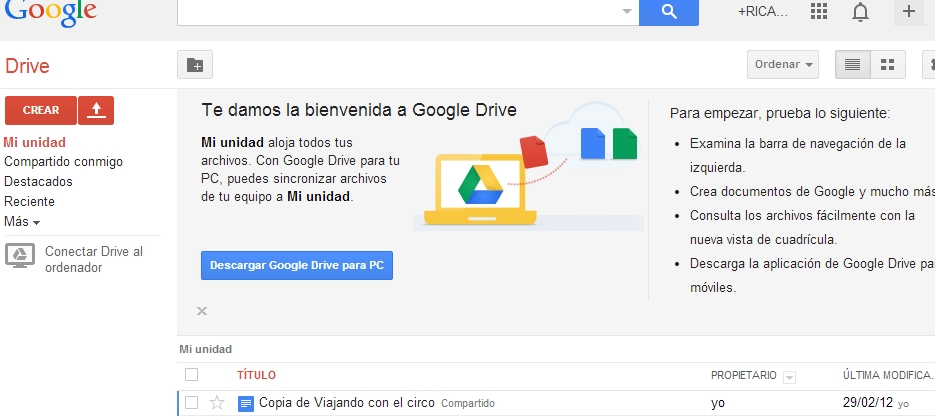

# Tareas Digitales

Una forma de favorecer el uso de los equipamientos TIC es presentar a nuestros alumnos las tareas en formato digital, así su realización se hará sobre el formato que nosotros les hemos propuesto. El aspecto final de nuestras propuestas digitales variará mucho dependiendo de nuestra formación previa y no debemos agobiarnos por querer realizar propuestas técnicamente complejas pues podemos comenzar utilizando herramientas informáticas ya conocidas, como el procesador de textos o las presentaciones, la posibilidad que nos ofrecen para insertar hipervínculos, imágenes, multimedia... puede ser suficiente para sugerir enlaces a distintos puntos de interés. Naturalmente, estos documentos digitales, además de ser proyectados en la PDI tienen que estar en posesión de nuestros alumnos, y para eso están la [****intranet****](http://www.catedu.es/intranetypupitre/index.php), edmodo, el correo electrónico...

Si disponemos de una cuenta de [gmail ](https://www.google.com/accounts/ServiceLogin?service=mail&amp;passive=true&amp;rm=false&amp;continue=http%3A%2F%2Fmail.google.com%2Fmail%2F%3Fhl%3Des%26ui%3Dhtml%26zy%3Dl&amp;bsv=zpwhtygjntrz&amp;scc=1&amp;ltmpl=default&amp;ltmplcache=2&amp;hl=es)(el correo proporcionado por **Google**), tendremos acceso al servicio [Google docs](http://www.google.com/google-d-s/intl/es/tour1.html) y a **[Google](http://gdrive-blog.blogspot.com.es/)** [Drive](http://gdrive-blog.blogspot.com.es/), que permite la creación de documentos on-line de una forma muy similar y en un entorno más sencillo que el ofrecido por las suites ofimáticas que manejamos habitualmente y, además, ofrecen la posibilidad de compartirlos, tanto una vez realizados como en el momento de su creación, que puede ser colectiva. 

También existen otras alternativas a estas cuentas...

 

Fig 2.26.Captura pantalla.Imagen propia[ ](http://www.flickr.com/photos/infocux/)

También podemos subir al servidor de **Google **los archivos que hayamos realizado con procesadores de textos, hojas de cálculo o presentaciones en nuestro ordenador, ya que es compatible con numerosos formatos. De esta forma podemos poner a disposición de los alumnos y de otros compañeros la biblioteca de recursos que hemos ido acumulando a lo largo de nuestra vida docente. Estos archivos pueden pasar a formar parte de nuestro blog o nuestra wiki mediante vínculos.

Poco a poco podemos ir introduciéndonos en la creación de **blogs **o **wikis**, al fin y al cabo, salvados el proceso de alta y configuración, generalmente muy sencillo, y comprendidos un par de procedimientos para insertar imágenes, crear categorías o etiquetas y autorizar usuarios si van a participar otros compañeros (te animamos a ello) o alumnos... la edición de las entradas en estos contextos web 2.0 se realiza mediante un sencillo procesador de textos. Aunque hablaremos de ello más adelante, recordemos que estos sitios se crean para trabajar con los alumnos o, mejor, para que los alumnos trabajen con ellos, así que busquemos cauces de participación.

Seguro que conociendo las propuestas de otros compañeros nos llama la atención la inclusión en sus sitios web de elementos realizados con [herramientas web 2.0](http://www.catedu.es/arablogs/blog.php?id_blog=1145), y tendremos curiosidad por utilizar uno de [vídeos ](http://www.catedu.es/arablogs/blog.php?id_blog=1145&amp;id_articulo=48626)o de **[poesía visual](http://www.catedu.es/arablogs/blog.php?id_blog=1145&amp;id_articulo=49252)**, de [mapas conceptuales](http://www.catedu.es/arablogs/blog.php?id_blog=1145&amp;id_articulo=55905), **[gráficas ](http://www.catedu.es/arablogs/blog.php?id_blog=1145&amp;id_articulo=56123)**o **[presentaciones](http://www.catedu.es/arablogs/blog.php?id_blog=1145&amp;id_articulo=44075)**. Utilizar estos servicios, la mayoría en inglés, es sencillo, suele ser suficiente con un registro rápido, un vistazo intuitivo si desconocemos la lengua, crear o subir lo que queramos distribuir, obtener el código y [embeberlo ](http://www.catedu.es/arablogs/blog.php?id_blog=1145&amp;id_articulo=47237)en nuestro sitio.

Otra posibilidad es aventurarse en la creación de una [webquest ](http://www.uib.es/depart/gte/edutec-e/revelec17/adell_16a.htm)con el editor del [CATEDU](http://catedu.es/crear_wq/z_usuarios/ingreso_usuarios.php) o un [cazatesoros](http://www.educacontic.es/blog/las-cazas-del-tesoro-examen-como-trabajar-la-lectura-comprensiva), por ejemplo.

En todo caso, las tareas que presentemos a nuestros alumnos deben de contemplar la posibilidad de que ellos hagan consultas en soportes informáticos e internet en busca de documentación, soluciones a cuestiones o situaciones problemáticas, datos concretos u opiniones.

**Alumnos “expertos” **

En algunos casos hay destrezas de los alumnos que no aprovechamos porque no sabemos que las tienen (o no queremos saberlo). Dejemos que sean ellos quienes nos demuestren lo que saben y pueden hacer y seguro que más de uno nos sorprende. Démosles la oportunidad de presentar y explicar sus trabajos en PowerPoint, en webs, en documentos de texto...[ ](http://www.aularagon.org/Files/UserFiles/File/ESCUELA2.0/ESCUELA2.0/resources/relieverios.ppt)

Buena parte del alumnado de las aulas integradas en el programa Escuela 2.0 tiene un nivel de formación en TIC elevado. Este conocimiento viene derivado del uso fuera y dentro de las aulas, y tiene tanta incidencia en los aspectos de hardware como de software.  La primera consecuencia que tiene esta realidad es que en las aulas se debe de sacar provecho educativo a las características de este alumnado. Esto se puede lograr de diferentes maneras como:

Fig 2.27. Tomada del Curso Escuela 2.0. JR Olalla.

Implicando a los alumnos (de forma individual, estructurada, rotatoria o como se considere más oportuno) en la utilización de los dispositivos del aula. Por ejemplo, estableciendo turnos semanales para la buena conservación de los dispositivos de aula o asegurando que el profesor tenga estos mismos dispositivos ya en marcha en el momento de comenzar las clases. Son los conocidos en algunos centros donde ya se usan estos procedimientos, como “alumnos expertos”.

- Para un buen número de actividades (desde las presentaciones de diapositivas hasta el mantenimiento de un blog) los alumnos poseen en un alto porcentaje la formación y experiencia suficientes. No es preciso que el profesor maneje estas herramientas para que sus alumnos las usen. Basta con que estos sepan emplearlas con sentido educativo. El profesor deberá valorar aspectos como la expresión, adecuación, adquisición de contenidos…, y no los técnicos (salvo que sean implícitos en el uso de la herramienta).
- El acceso al conocimiento ya no es exclusivamente literario en formato de papel. La red es una fuente de conocimientos más amplia, accesible y actualizada. Por lo tanto, deberá evitarse su prohibición de uso alegando, por ejemplo, que en Internet hay mucha información no válida (lo mismo ocurre, en similar medida, en los medios de difusión tradicionales). La labor del profesor será, en todo caso, la de orientar en el buen uso crítico de esta información, en fomentar el respeto a la propiedad intelectual y en la correcta referencia a las fuentes consultadas.
- No es necesario crear alumnos expertos, es decir, no hay que caer en el error de dar cursos de informática; ante una nueva cuestión técnica bastan unas pocas explicaciones antes de su uso; el aprendizaje se realiza de forma natural al utilizarla para un fin educativo y se incorpora directamente a las competencias del alumno.
- Los alumnos expertos son de gran ayuda en la formación del propio profesorado si conseguimos eliminar la barrera de la tarima y, desde luego, para la formación y tutorización de los alumnos que carecen de experiencia previa.

