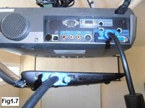
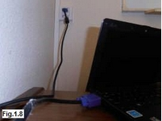
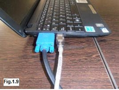
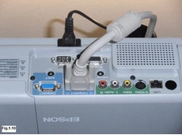
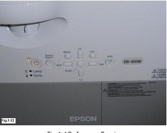
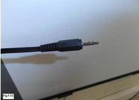
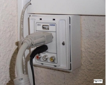

# Tengo un problema...¿ qué hago?

Este es **uno de los grandes temores** que nos atenazan como docentes y que en ocasiones supone la excusa para no decidirnos a utilizar la PDI en nuestras clases.

Los problemas para que el funcionamiento no sea el correcto pueden ser muy variados y en ocasiones, solucionarlos, estarán fuera de nuestras posibilidades (**no somos técnicos, somos docentes**), pero en muchas otras se deberá a pequeños fallos fácilmente solucionables.

Es importante conocer cómo se conectan todos los elemneto que forman el conjunto de la PDI, para, en caso de mal funcionamiento, poder descartar que se trata de un cable suelto que puede dar al traste con toda la sesión.

En cualquier caso un par de consejos que he oído repetir en multitud de ocasiones y que la experiencia demuestra que son útiles:

- No hay nada que no resuelva un "**reinicio**" del sistema (no siempre funciona.... también habrá que considerar lo que le cuesta reiniciarse a nuestro ordenador). Normalmente los ordenadores de los centros están "congelados" lo que implica que sea lo que sea que está fallando, al reiniciar quedará como estaba al principio.
- Tener preparado un "**plan B**", que no requiera de esa aplicación que no funciona, de ese vídeo que no se ve, de esa página que hoy no se carga.....

## **COMPROBACIÓN DE LAS CONEXIONES**:

### COMPROBACIÓN 1:

Cable VGA que conecta el ordenador con el proyector (es inconfundible por sus terminales de color azul o metálico pero siempre con tornillos que permiten ajustarlos). Puede que el proyector sea inaccesible y el cable se conecte en una caja de conexiones (Fig.1.30 y 1.31).</td>

### COMPROBACIÓN 2:

La PDI se conecta al ordenador por un cable USB (igual que la conexión de los "lápices de memoria").(Fig.1.32)</td>

### COMPROBACIÓN 3:

El proyector debe estar conectado a la red eléctrica y encendido (puede haber un interruptor o el mando a distancia que permite encenderlo).(Fig.1.33 y 1.34)

Para saber algo más sobre la configuración del Proyector, consulta en "Ampliación".</td>

### COMPROBACIÓN 4:

Si es necesario se ajusta la imagen proyectada a la superficie de la PDI gracias a los mandos del proyector (reproducidos en el mando a distancia). Lo normal es que si la instalación es fija, no sea necesario tocar estos ajustes (Fig.1.35)

Es muy frecuente que en los centros esta instalación se haya canalizado y los cables no se encuentren a la vista, tan sólo veamos las conexiones con el ordenador (o con la base en caso de los tablet).

### COMPROBACIÓN 5:

Los altavoces se enchufan al equipo mediante un conector tipo JACK, a la salida de audio (donde se conectarían los altavoces o los auriculares).Puede que el otro extremo vaya a una caja de conexiones(Fig.1.36 y 1.37)

Por último no olvides, en caso de necesitar sonido, que además de los ajustes del sonido desde el ordenador (fijarse que no está en silencio), en casi todas las instalacines hay un interruptor que conecta/desconecta los altavoces.

Ya lo he comprobado todo, me pongo a interactuar con la PDI y..... el puntero no responde. Podría ser la **pila**, será conveniente tener a mano un repuesto para descartar este problema (Fig.1.38).

### COMPROBACIÓN DE LA SALIDA DE LA IMAGEN: (Para equipos portátiles)

En los equipos portátiles (incluidos los tablet) podemos elegir la forma en que la imagen se visualiza cuando le conectamos un proyector: que se vea sólo en el portátil, sólo a través del proyector o por ambos.

Para ello hay que pulsar simultáneamente la teclas **Fn** y la que en el aparato se encargue de controlar la salida de imagen. Como ves en la Fig.1.39, puede variar según modelos:

Pulsándolas reiteradamente se irá pasando de un visionado a otro (sólo ordenador, sólo proyector, ambos).

>**info**
># Importante
>
>Recuerda que a pesar de todas las comprobaciones en ocasiones el problema no se resuelve, pero eso no puede parar la clase habrá que **tener siempre preparada una alternativa** que no nos haga perder el tiempo y nos desanime en el uso de la PDI.

