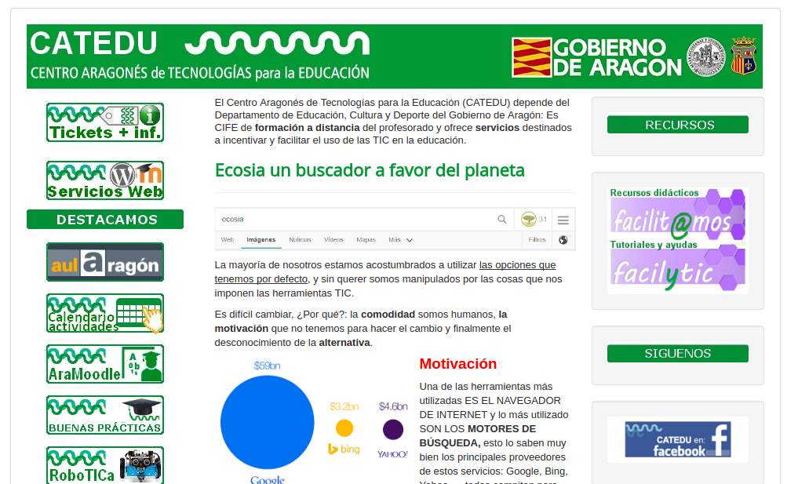

### U1. CATEDU

[CATEDU](http://web.catedu.es/webcatedu/) es el Centro Aragonés de Tecnologías para la Educación y está situado en [Alcorisa (Teruel)](http://maps.google.com/maps?f=q&hl=ca&geocode=&q=Alcorisa+%28Teruel%29&sll=37.0625,-95.677068&sspn=38.775203,63.369141&ie=UTF8&ll=40.894311,-0.380402&spn=0.289629,0.495071&t=h&z=11&iwloc=addr). Fue creado en 2006 mediante un acuerdo de los Departamentos de Educación, Cultura y Deporte y de Ciencia, Tecnología y Universidad, la Universidad de Zaragoza y el Ayuntamiento de Alcorisa. Su misión es: _Investigar, desarrollar y difundir los recursos tecnológicos y de comunicaciones que aporten beneficios para cualquier nivel del ámbito educativo aragonés. Para tal fin realizará trabajos de investigación, experimentación, desarrollo, evaluación, publicación y difusión de productos y servicios cuyos destinatarios serán las instituciones educativas y por extensión el Sistema Educativo en Aragón en toda su amplitud._

### Sitio Web

### Descripción general

CATEDU se dedica a ofrecer servicios (espacios Moodle, Wordpress para centros y profesores y espacios FTP) y formación on-line para el profesorado como el curso actual que estás haciendo.

Todos los cursos son accesibles desde [Aularagón](http://moodle.catedu.es/) aun cuando no tengas usuario. Puedes acceder como invitado sin necesidad de tener contraseña. La oferta de cursos se ha triplicado en este último año, ofreciendo tanto cursos tutorizados como mini-cursos (10-20 horas) desasistidos.

Además, todos los contenidos tienen licencia Creative Commons, por lo que puedes hacer uso de ellos libremente en tus clases.

Puedes descartarte desde su [repositorio de libros](https://legacy.gitbook.com/@catedu) todos los contenidos en pdf, epub y mobi.

