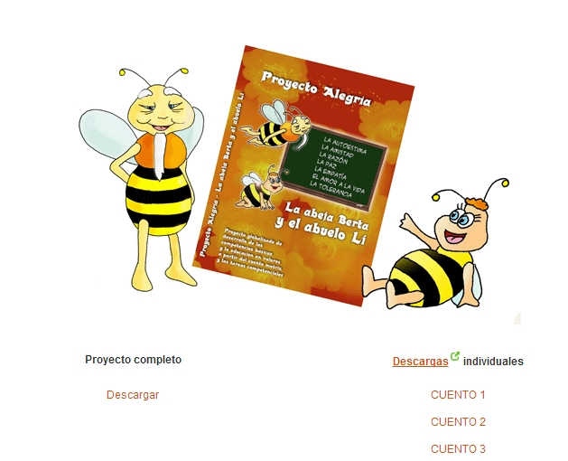
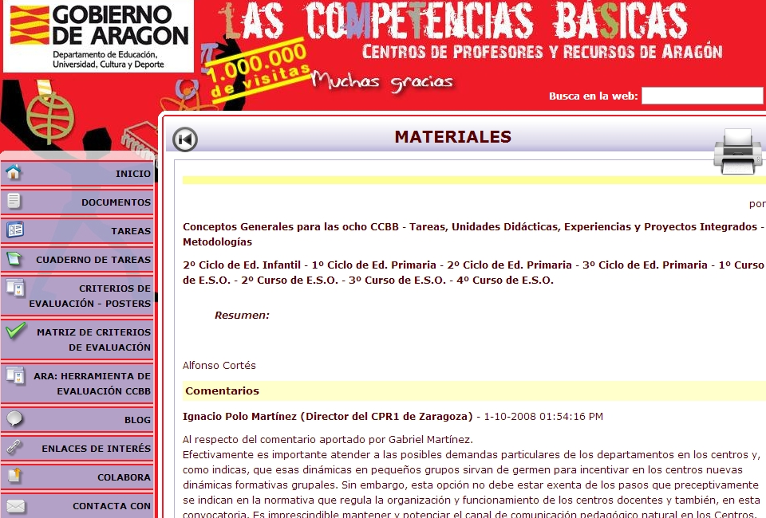

# U1. Competencias básicas

Iniciamos este Módulo presentando una reflexión acerca de porqué trabajar en competencias en el día de hoy (Martín Pinos)

### 5 Buenas razones para empezar a trabajar por competencias

**1\. Es mejor que lo que hacíamos antes.** No te queda duda, pues permiten no sólo adquirir conocimientos y desarrollar capacidades, sino también poder aplicarlas en contextos diversos para resolver problemas de cierta complejidad. Es decir, permiten enseñar para la vida al aplicar los aprendizajes escolares a contextos diferentes al escolar.

**2\. Parten de lo que ya hacíamos en el aula**. Para llegar a la competencias, el trabajo sobre conocimientos y capacidades en base a ejercicios, actividades o problemas de aplicación de los contenidos, sigue siendo necesario, y es, además, el punto de partida. Lo que ya hacíamos nos vale, a veces tal cual, a veces con pequeñas modificaciones. Sólo que a partir de ese trabajo avanzamos un poco más buscando situaciones variadas de partida, escenarios o contextos significativos, funcionales, motivantes, que permitan aplicar lo trabajado anteriormente. ¿Cuántas sumas necesita un niño hacer antes de usar la suma para resolver problemas de su vida diaria?

**3\. Sus resultados se aprecian a corto plazo**. No hace falta esperar para comprobar cómo la motivación, el interés y los resultados académicos mejoran cuando incorporamos metodologías más acordes a las competencias, cuando empezamos a proponer tareas o a incluir trabajos cooperativos.

 **4\. Trabajar las competencias puede ser sencillo. ** Sí, se puede hacer de forma sencilla (aunque parezca mentira). El modelo PISA de confección de tareas competenciales es sencillo de entender y de aplicar, Los cambios metodológicos que sugieren  o mejor se avienen a las competencias pueden ser asumidos desde diferentes niveles de complejidad. Cada cual elige el suyo, pero en ningún caso es obligado apostar por fórmulas que en las que nos sintamos incómodos por su dificultad.

**5\. Seguramente coinciden con tu idea de lo que es educar. **Porque los docentes trabajamos con la vista puesta en el desarrollo integral del alumnado, con la aspiración de ayudarles a ser buenos ciudadanos y mejores personas, capaces de desenvolverse eficazmente en la vida en todos sus ámbitos (relacional, profesional, ocio...). Porque la felicidad de nuestro alumnado nos importa. Y, estoy convencido (cada día más, cuanto más las trabajo, más) de que las competencias son una herramienta excepcional para acercarnos a los fines de la educación.

  
  
Leer más: [http://competentes-felices.webnode.es/](http://competentes-felices.webnode.es/?utm_source=copy&utm_medium=paste&utm_campaign=copypaste&utm_content=http%3A%2F%2Fcompetentes-felices.webnode.es%2F)  

Y También presentamos el recurso el recurso didáctico: **Proyecto Alegría. La abeja Berta y el abuelo Li. Proyecto globalizado de desarrollo de las competencias básicas y la educación en valores,** que ha sido elaborado y puesto en práctica en el CEIP Mª Moliner de Zaragoza.  
  
Después de obtener en el 2005 el primer Premio Nacional de Innovación Educativa con su proyecto: _Un mundo de _alternativas, **Martín Pinos Quílez** nos presenta [ahora](http://www.cpr1.es/web/index.php/proyecto-alegria# "Click to Continue > by Text-Enhance") este CD-ROM interactivo con una propuesta didáctica para **4º de Primaria **que conecta con la Psicología Positiva, las inteligencias múltiples y la inteligencia emocional.

Y, por último un recurso más para la Aplicación didáctica de las TIC  a través de las CCBB.

