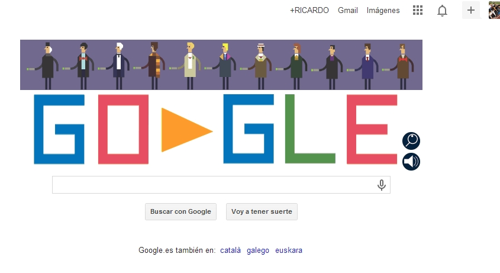

# U1. Fuente de información

Todos hemos utilizado **Internet como fuente de información**: entramos a **google**, que muchos hemos adoptado como página de inicio incorporando el servicio **igoogle **que muestra de entrada el contenido que decidamos mediante ****gadgets ****o suscripciones a los **RSS **de páginas que nos interesan para acceder, de un vistazo, a sus novedades; también hemos incorporado la barra de google a nuestro navegador para hacer las búsquedas más accesibles, aunque utilizamos poco la **búsqueda avanzada**para restringir los cientos de miles o millones de páginas que en ****0,X**** segundos google alardea de haber encontrado.

 

**Y la información puede ser de muchos tipos:**

- **Escrita **en cualquier página.
- **Enciclopédica**, a través de compendios web 1.0 como la [Gran Enciclopedia Aragonesa](http://www.enciclopedia-aragonesa.com/) o web 2.0 como **[Wikipedia](http://es.wikipedia.org/wiki/Wikipedia:Portada)**.
- **Semántica **a través de [**diccionarios**.](http://www.rae.es/rae.html)
- **Recíproca **en los [foros ](http://www.cambio-climatico.com/foro/)abiertos sobre cualquier tema imaginable.
- **Gráfica**, a través del [buscador de imágenes](http://images.google.es/imghp?hl=es&amp;ie=UTF-8&amp;tab=wi) o de cualquier catálogo gratuito y con licencia libre.
- **Videográfica **en cualquiera de los catálogos de vídeos como **[youtube](http://www.youtube.com/?gl=ES&amp;hl=es) **o el propio [google](http://video.google.es/?hl=es&amp;ie=UTF-8&amp;tab=wv).
- **Colectiva **en algún servicio de creación colectiva de la red como este [periódico ](http://catedu.es/nexunews/)Nexus News.
- **Bibliográfica **dentro de índices como [dialnet](http://dialnet.unirioja.es/).
- **Geográfica **en sentido amplio como en [google maps](http://maps.google.es/maps?sourceid=navclient&amp;hl=es&amp;rlz=1T4GGLL_es&amp;q=dialnet&amp;um=1&amp;ie=UTF-8&amp;sa=N&amp;tab=wl) y [google heart](http://earth.google.es/), donde, además, podrás acceder al universo, a las ciudades en 3D o a la antigua Roma, al museo del Prado y a otros servicios que se van incorporando.
- **Meteorológica **de [España ](http://www.aemet.es/es/portada)o el resto del [mundo](http://www.tutiempo.net/).
- **Periodística **en cualquiera de los [medios ](http://kiosko.net/es/)escritos o audiovisuales.
- **Simbiótica**, si tomamos recursos de [alguna zona](http://www.slideshare.net/) de descargas y dejamos otros en el mismo lugar.
- **Parásita**, si sólo [nos aprovechamos](http://www.rincondelvago.com/) de ella.

Y eso sólo mostrando algunas posibilidades de indudable valor pedagógico directo; si tenemos en cuenta que cualquier página puede formar parte de una tarea escolar, podríamos añadir páginas de moda, agencias de viajes, cualquier tipo de comercio, institución o empresa...