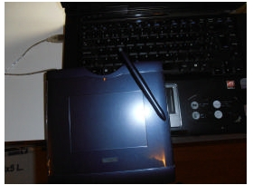

# U2.  LA PDI.Soporte para el profesorado

La integración de las TIC en el aula se produce de una forma adaptada al profesorado que participa en él; como si de una carrera ciclista se tratara, ha de permitir que el pelotón mayoritario mantenga la marcha y recupere a los rezagados mediante el apoyo del equipo, además de facilitar las escapadas, individuales o colectivas para que reviertan en beneficio del propio equipo. Estos diferentes ritmos de carrera pueden y deben conjugarse de forma coordinada por parte del responsable del programa en el centro. Esta adaptación a las TIC por parte del profesorado (que viene durando desde hace ya demasiados años y parece que no acabará nunca) contrasta con la inmersión inmediata y ávida de nuestros alumnos en el uso de estos medios, y el requerimiento para que los docentes lo hagamos con la misma inmediatez.

Por ello, proponemos una **hoja de ruta** desde un punto de salida que supone cambiar el encerado tradicional por otro electrónico e interactivo, con la intención de que cada participante se incorpore a ella en el punto correspondiente a su nivel actual (al principio, en el tercer paso, en el quinto...), sin necesidad de volver por caminos ya recorridos individualmente y con la pretensión de que todo el profesorado llegue a la meta en un momento u otro, dependiendo de su punto de partida y de su capacidad de avance.

2.3. Tomada del curso Escuela 2.0 de JR Olalla

 Conviene recordar que no se trata de llegar un punto donde nos encontremos cómodos, ese lugar en el que seguimos haciendo lo que hacíamos aunque con otra pizarra, sino que se trata de adoptar metodologías que nos permitan integrar la nueva herramienta para conseguir mejorar las competencias (todas, no sólo la digital) de nuestros alumnos ya que son ellos los verdaderos destinatarios de la integración de las TIC.

## Importante

La  PDI  **la  usaremos  cuando  sea  necesaria:**  por  el  tipo  de  actividad,  como  recurso  o  como herramienta motivadora y de ampliación. Usar por usar la pizarra, puede llevar a quemar la herramienta en el aula. Abusar del recurso significa limitar sus posibilidades y funciones.

## Caso práctico

Vamos a ponernos en situación:

Queremos comenzar a usar la PDI y lo vamos a hacer sobre una presentación de PowerPoint, bien ya hecha o realizada para la clase que vamos a dar.

<input class="feedbackbutton" name="toggle-feedback-quesFeedback0b38" onclick="$exe.toggleFeedback(this,true);return false" type="button" value="Mostrar retroalimentación"/>

### Retroalimentación

Vas a exponer la presentación como si estuvieses en clase (si lo haces de verdad ¡fenomenal!) y vas a ir marcando, subrayando, añadiendo señales,.... tal cual lo harías en la realidad.

Lo ideal sería hacerlo sobre una PDI, pero en caso de que no puedas acceder a ella, puedes utilizar la pantalle del Tablet o, en su defecto, una Tableta Gráfica (como la de abajo) que permite escribir sobre la pantalla.

 

2.4: Imagen Propia 

Si tenes cualquier duda no dudes en consultarlo mediante el correo del curso.

No hay una solución única, cada cual habrá realizado aquello que sea más propio de su área o nivel. Tan sólo algunas consideraciones de cara al futuro:

Cuando realices este tipo e actividad deberás tener en cuenta el tamaño del archivo final (si utilizas muchas imágenes de gran resolución, el archivo puede ser enorme), si te interesa o no guardar las anotaciones y, especialmente, el aprovechamiento que a esta posibilidad le puedes dar en el aula (sólo explicas tú, participa el alumnado.... es sólo expositivo, presenta cuestiones a responder, partes sin completar,....).

## Actividad de lectura

Proponemos a modo de lectura y reflexión personal este texto 

**Pizarra digital interactiva**

Ya hemos dicho que disponer en el aula de una pizarra interactiva con su correspondiente proyector o de un ordenador para cada alumno no cambia necesariamente la forma de enseñar ni incrementa la innovación ni la calidad de la enseñanza; porque la innovación está en manos del profesor y los centros innovadores, no son más que el conjunto de profesores innovadores coordinados por un equipo directivo innovador, que construyen planes para innovar: **el cambio no está en los medios, sino en el profesorado dispuesto a cambiar**.

Es cierto que podemos poner en escena más recursos educativos si el aula dispone de una pizarra interactiva que si carece de ella, sobre todo si el profesorado utiliza modelos didácticos adecuados para sus alumnos, que faciliten su aprendizaje, incrementen su motivación y permitan la participación activa y significativa en su propio aprendizaje.

La pizarra digital en el aula la abre al mundo con el acceso inmediato a las fuentes de **información **de Internet y también a sus posibilidades de **comunicación interactiva** en tiempo real (chat, videoconferencia...) o diferido (comentarios, tablones, documentos y proyectos compartidos...). El mundo exterior entra en el aula a través de la prensa digital, los programas de televisión o de radio... podemos utilizar didácticamente muchos materiales realizados por profesores, alumnos y personas ajenas al mundo educativo: enciclopedias, estudios, museos, mapas, viajes, imágenes, sonidos, vídeos...

La pizarra digital actúa como **germen de innovación y cooperación**, ya que a través de ella, profesores y alumnos pueden compartir y comentar **ENTRE TODOS** la información y los recursos de que disponen (presentaciones multimedia y otros trabajos de clase en formato digital, vídeos, documentos en papel para proyectar con un lector de documentos o una cámara...). Y esta posibilidad de presentar y comentar conjuntamente en el aula todo tipo de información y actividades facilita la aplicación de nuevas metodologías didácticas, un mejor tratamiento de la diversidad y que los alumnos tengan un papel más activo y participen más en las actividades de clase, tengan más autonomía y dispongan de más oportunidades para el desarrollo de competencias tan importantes en la sociedad actual como buscar y seleccionar información (aportando puntos de vista, saberes y preconocimientos, culturas diversas...), realizar trabajos multimedia y presentarlos públicamente a los compañeros, desarrollo de la creatividad ...

Todo esto aún se ve reforzado cuando los estudiantes pueden acceder a Internet desde casa (en 2012 un 67,9% de las familias españolas disponen de banda ancha) donde pueden revisar los materiales que se han mostrado en clase y descargarlos o subirlos en un aula virtual accesible desde el centro y desde casa para presentarlos en cualquier momento en clase..

Y de esta forma los alumnos están más atentos, motivados e interesados por las asignaturas (incluso en entornos en los que resulta difícil mantener la disciplina y el ambiente de trabajo en clase). Las clases pueden ser más vistosas, entretenidas y audiovisuales, facilitando a los estudiantes el seguimiento de las explicaciones del profesorado (se sienten en su mundo ante el multimedia de la pantalla o Internet) y la comprensión de los temas, que ahora se aproximan más a sus experiencias previas. Así resulta más fácil relacionar lo nuevo con lo que ya saben y realizar unos aprendizajes más significativos.

El profesorado aumenta su autoestima profesional: está utilizando eficazmente las tecnologías avanzadas, ha mejorado el quehacer docente, mejora la formación del alumnado... Explora en Internet e investiga en la clase. Continuamente van aprendiendo cosas nuevas, a partir de los materiales que se presentan en clase. Resulta gratificante y divertido. Con el tiempo va descubriendo nuevas posibilidades metodológicas y muchos nuevos recursos aplicables para el tratamiento de la diversidad.

Por otra parte, estamos ante una **tecnología limpia, transparente** y que ****no da problemas**** (si un día no va el ordenador o Internet da problemas, simplemente desarrolla una clase alternativa con o sin la pizarra digital) y que ****resulta ********muy fácil de utilizar****: enseguida se aprende todo lo necesario para empezar. El profesorado se familiariza rápidamente con el sistema, y aunque a veces deberá realizar esfuerzos complementarios (búsqueda de webs interesantes, elaboración de esquemas y apuntes...), en general su empleo ****no supondrá una significativa mayor dedicación****, sobre todo si se trabaja en equipos docentes presenciales o virtuales.

Según los datos de la investigación realizada desde el grupo DIM (**[Promethean 2006-2008](http://www.slideshare.net/peremarques/investigaciones-sobre-las-pizarras-interactivas-promethean-presentation)** y 2008-2010), aunque la utilización de esta tecnología puede suponer algo más de trabajo, los profesores consideran que merece la pena por los resultados que se obtienen, y destacan las siguientes ventajas al utilizar las pizarras digitales:

- Potencian la motivación y la atención del alumnado en general.
- Permiten acceder en clase a muchos recursos y compartirlos.
- Facilitan la comprensión (imágenes, simulaciones ), investigar, crear...
- Hay más implicación y participación del alumnado en las actividades (les gusta).
- Facilitan la enseñanza, el aprendizaje y el logro de los objetivos educativos
- Facilitan actividades colaborativas y compartir recursos.
- Facilitan la realización de correcciones colectivas
- En general su uso aumenta la satisfacción, motivación y autoestima docente.
- Facilitan renovación metodológica que promueve la innovación didáctica.

A lo que puede añadirse que ese supuesto trabajo extra inicial se compensa posteriormente con la disponibilidad de los recursos hallados y utilizados en momentos anteriores.

Y en esta línea estaban también las conclusiones de la investigación **[SMART](http://www.peremarques.net/pdigital/es/SMART.htm)**:

- Instrumento de comunicación entre docentes y discentes en clase, que facilita tanto la aplicación de metodologías tradicionales centradas en la enseñanza como de metodologías centradas en los estudiantes (aunque la mayoría de profesores considera que ha innovado).
- Resulta útil en todas las asignaturas y niveles, proporcionando recursos visuales y nuevas posibilidades metodológicas que facilitan la presentación y comprensión de los contenidos, el tratamiento de la diversidad, la realización de actividades más dinámicas y una mayor motivación y participación de los estudiantes.
- Se puede aprender más y mejor con la PDI, aunque esto dependerá de las metodologías.
- Profesores y estudiantes prefieren hacer las clases con la PDI.

<input class="feedbackbutton" name="toggle-feedback-44_42_6" onclick="$exe.toggleFeedback(this,true);return false" type="button" value="Mostrar retroalimentación"/>

### Retroalimentación

Reflexiona acerca de los posibles usos de las TIC para trabajar la competencia comunicativa en todas las áreas.

