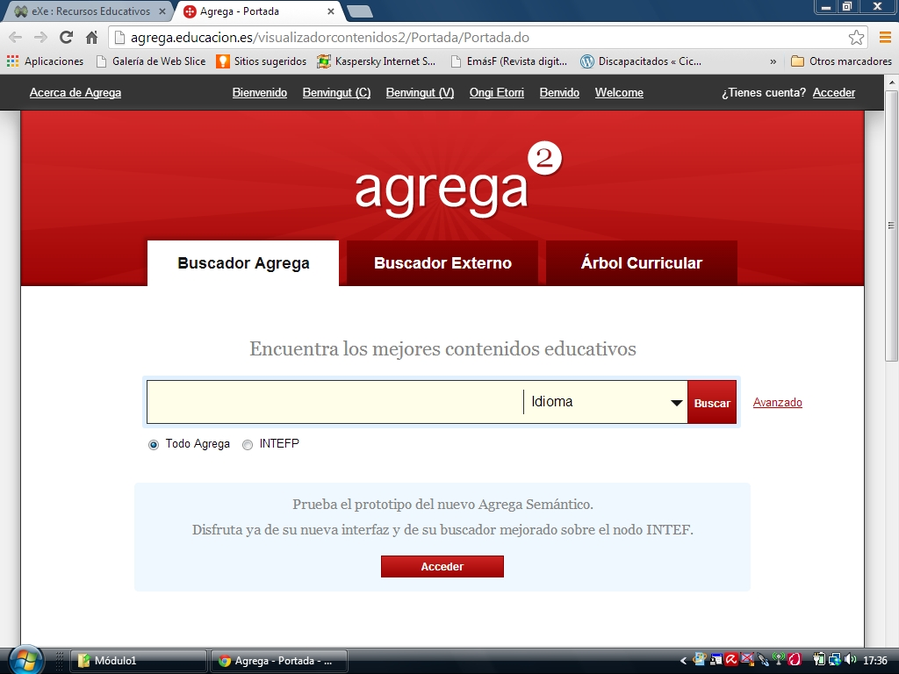

# U2. AGREGA

**[Agrega](http://agrega.educacion.es/visualizadorcontenidos2/Portada/Portada.do)** es una plataforma cuya pretensión es unificar la búsqueda de recursos desperdigados por distintos catálogos de las administraciones autonómicas en un solo buscador. Pero mejor dejar que se explique el propio servicio:

- Es una **iniciativa global** de interés común entre red.es, el Ministerio de Educación, Política Social y Deporte y las Comunidades Autónomas. Entre todos ayudamos a desarrollar una Plataforma de Contenidos Digitales con la misión de compartir y potenciar el uso de contenidos educativos digitales entre el profesorado y el alumnado de todas las Comunidades Autónomas.
- **Agrega** es una federación de **repositorios de objetos digitales educativos** formada por todas las Comunidades Autónomas. Los contenidos educativos que se pueden encontrar en Agrega están curricularmente organizados de forma que puedan ser utilizados en la enseñaza reglada no universitaria.
- El objetivo de **Agrega** es facilitar a la comunidad educativa una **herramienta útil que integre las nuevas Tecnologías de la Información y la Comunicación** en el aula y fuera de ella, aunando los esfuerzos de todas las Comunidades Autónomas y permitiendo acceder a cualquier contenido, desde cualquier sitio y sea cual sea el criterio de búsqueda utilizado.
- En **Agrega** encontramos una potente herramienta de búsqueda y acceso a los contenidos educativos de forma fácil y rápida. Se podrán rastrear contenidos educativos de cualquier Comunidad Autónoma para utilizarlo inmediatamente en el aula sin complicados procesos de instalación.

La búsqueda de recursos en Agrega puede hacerse por:

- Nombre
- Taxonomía
- Nivel de agregación:
	- medios
	- objetos de aprendizaje
	- secuencias didácticas
	- cursos
	- planes y programas de formación
- Formato: animación, vídeo, sonido imagen, documento...

Pueden hacerse acotaciones de búsqueda por:

* **Propiedades de contenido**, entre otros:
	- Permite especificar el **tipo de recurso** seleccionándolo de una amplia lista que va desde la enciclopedia digital al juego didáctico, pasando por la simulación o la WebQuest hasta casi cincuenta posibilidades.
	- Idioma
	- **Proceso cognitivo** (comprender, redactar, sintetizar... y así hasta casi cuarenta).
	- **Contexto**: laboratorio, aula, distancia, domicilio, real...
	- Valoración
	- Destinatarios
* Por **tesauro**
* Por **ámbito territerial de procedencia**.

