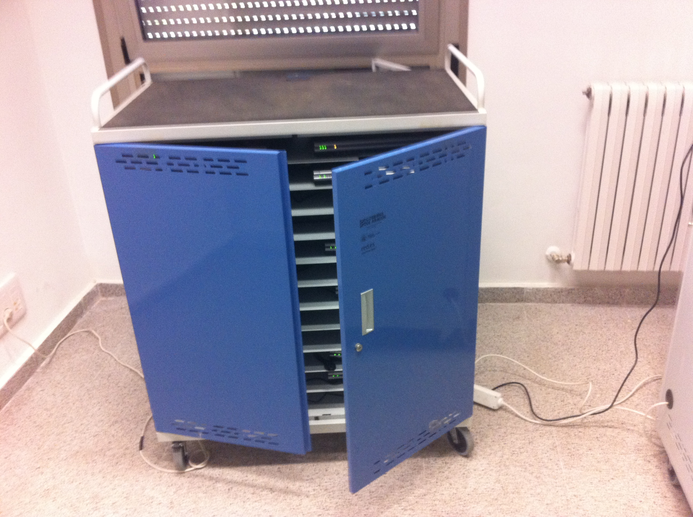

# U2. Equipamiento técnico, recursos a utilizar y organización de los centros

**En nuestros centros conviven:**

- Equipos de sobremesa en las aulas (preferentemente) o en un aula de informática (modelo que se ha demostrado poco ágil y eficaz al investir la visita al aula de informática de un ropaje fuera de la cotidianeidad del aula).
- Ordenadores miniportátiles.
- Táblets-PC.
- Las primeras tabletas.
- PDIs: pizarras digitales interactivas en algunas o muchas aulas.
- Videoproyectores para estas pizarras o conectados a táblets (prácticamente cumplen la msma función), a sobremesas o a portátiles....
- Altavoces
- Hay cajas de control para todo ello o amasijos de cables más o menos ordenados y que siempre se empeñan en desordenarse, cruzarse y liarse entre ellos.
- Servidores.
- Software educativo u otro de funcionamiento como la [I****ntranet****.](http://www.catedu.es/intranetypupitre/index.php)
- Conectividad wifi que va mejorándose poco a poco y, a veces,suficiente para el acceso a Internet de toda la ganadería de equipos.
- Carros para la custodia y carga de los portátiles.

 

Fig.1.3.Imagen propia

 

**Recursos y organización**

 

Esta variedad de recursos tecnológicos, nos obliga a centrarnos en lo último que ha ido llegando, entendiendo que ya controlamos suficientemente lo más viejo. Y nos requiere a plantear algunas cuestiones respecto a su organización que, si bien no está recogidas en los protocolos, pueden servir para aplicar otras fórmulas diferentes a las habituales.

 

<li>**Pizarras Digitales Interactivas**
<ul>
- Conexión y funcionamiento
- Manejo instrumental
- Algunas recomendaciones.

- Un cambio en la tecnología
<li>Recomendaciones y protocolos:
<ul>
- Adjudicación al alumno.
- Organización de la red local (ips).
- Documentación de control.
- El proceso de entrega.
- Formación mínima para el alumno.
- Consejos de mantenimiento.
- Normalización común.
- ¿Se los llevan a casa? ¿Cuándo? ¿Quiénes? ¿Para qué?
- Los miniportátiles de aula.

- Ordenador fijo de aula.
- Servidor: contenidos y administración.
- Sonido y caja de control.
- Carros.

 

# Importante

Relacionados con la incidencia de las TIC en la organización y la gestión del centro, destacamos los siguientes aspectos

**La coordinación técnico-pedagógica y el mantenimiento de las TIC. **La creciente informatización de los centros hace necesaria una buena organización de sus recursos tecnológicos, y exige la existencia de personas encargadas de inventariar y mantener estos recursos, coordinar su uso y de asesorar al profesorado.  Por ello muchos centros tienen un ****coordinador de informática**** &lt;[http://www.peremarques.net/orgrecursos.htm](http://peremarques.pangea.org/orgrecursos.htm)&gt;, que se encarga de estas labores. Generalmente se trata de un profesor que cuenta con una pequeña reducción en su docencia.

A veces, este coordinador está asistido por un grupo de profesores con los que integra un ****departamento de tecnología educativa**** (o servicio escolar de medios y tecnologías), desde el cual además se impulsa con múltiples actividades el uso de las TIC a todos los niveles en la comunidad educativa del centro. Un ejemplo de esta fórmula organizativa lo tenemos en el "Colegio Irabia" de Pamplona &lt; [http://www.irabia.org/](http://www.irabia.org/) &gt;

Además de esta coordinación técnico-pedagógica se constata en muchos centros la necesidad de un **técnico informático **(con un perfil de técnico de FP) que pueda ocuparse de los aspectos más técnicos del mantenimiento de los sistemas informáticos del centro: mantenimiento de la intranet, detección de averías... A medida que se vayan extendiendo en los centros las salas de estudio informatizadas, su presencia resultará indispensable.

**- Cambios en la gestión con soporte TIC. **La integración de las nuevas tecnologías en los centros también se manifiesta con su uso intensivo en los trabajos de administración y de gestión (redes entre las distintas dependencias del centro -Intranet-, bases de datos centralizadas que evitan la duplicación de trabajos, automatización de tareas.), buscando con la ayuda de las técnicas de "gestión del conocimiento" formas de organización y funcionamiento de los centros más eficaces, eficientes, ágiles, flexibles y con una mayor descentralización administrativa. Algunas de las tareas que actualmente se realizan con el apoyo de las TIC son las siguientes:

- Gestión de secretaría académica: matriculación, expedientes de alumnos, certificados, títulos, boletines de notas, relaciones con la administración educativa (estadísticas, actas de evaluaciones), documentación administrativa en general...  - Gestión del personal: fichas del personal, control de presencia...  - Administración general del centro: contabilidad y economía: presupuestos, tesorería, facturación, previsión de pagos, inventarios ... - Gestión de tutorías: seguimiento y evaluación de los estudiantes: circulares informes a los padres, boletines de notas... - Gestión de bibliotecas: catálogos, préstamos... - Apoyo a dirección y jefatura de estudios: confección de horarios (de los cursos, de los profesores y de las aulas...), coordinación de programas...  - Gestión de actividades extraescolares, comedor escolar, transporte escolar...

Para desarrollar estas actividades se emplean tanto los programas de propósito general (procesadores de textos, hojas de cálculo, gestores de bases de datos...) como programas específicos (gestión de bibliotecas, contabilidad...), así como las intranet de centro y las plataformas de e-centro.

Las TIC también se utilizan para recopilar y centralizar los datos de estudiantes, profesores y escuelas a nivel de las Administraciones Educativas, poniendolos a disposición de profesores, padres, gestores educativos, ciudadanos en general (según proceda)...

No obstante, las TIC en los centros docentes se utilizan poco para aumentar la productividad del profesorado, gestionar la calidad de los resultados, reducir costos..., que son objetivos que se persiguen en la mayoría de lasx empresas al aplicar las TIC.

****- Los servicios e-centro. ****A través de los servicios que ofrece la intranet de centro o la plataforma de e-centro, entre los que destaca la ****web de centro ****y muchas veces los servicios de ****correo electrónico**** y ****disco virtual**** a los integrantes de la comunidad educativa (profesores, estudiantes, familias, PND...), se dispone de nuevos canales informativos, comunicativos y de gestión que atienden tanto los aspectos más relacionados con los procesos de enseñanza y aprendizaje como a los aspectos relacionados con la gestión tutorial, académica y administrativa del centro: circulares, informaciones generales, el diario digital del centro, consultas puntuales... Estas infraestructuras también facilitan la elaboración de las ****webs docentes**** por parte del profesorado, que proporcionan materiales educativos y orientaciones didácticas a los estudiantes, y pueden aumentar la participación e implicación de los padres y del entorno social próximo en las actividades del centro.

No obstante, el mantenimiento de estos servicios requiere también unas dedicaciones: la web de centro exige un ****webmaster**** y la intranet o plataforma e-centro requiere un ****administrador de la plataforma****.

**- La mediateca y las salas multiuso abiertas en horario extraescolar**. Además de constituir espacios cada vez más demandados dentro del horario lectivo para la realización de trabajos grupales, los centros van facilitando a los estudiantes el acceso a algunas aulas de ordenadores y salas multiuso fuera de las horas de clase, con el fin de facilitar la realización de sus tareas, especialmente a aquellos que no tienen ordenador en su casa.

En aquellos centros que disponen de una "**biblioteca escolar**" atendida por personal especializado, su transformación en mediateca la convertirá en un centro de recursos en papel y digital de inestimable valor para profesores y alumnos.

Por otra parte, la asunción de actuaciones formativas dirigidas a la ciudadanía (formación continua), especialmente para familias del centro, conducirá a que estos espacios (biblioteca, mediateca, aulas de ordenadores, salas multiuso...) estén abiertas más allá del horario escolar. En muchos casos los municipios, o el AMPA del centro, puede facilitar las personas necesarias para el desarrollo de estas actividades

 

Fig 1.4. Tomado de Pere Marqués: "Cambios en la docencia.Construyendo la Escuela del futuro"

