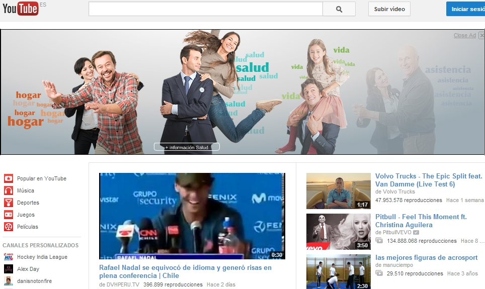

# U2. Una maleta de servicios

Que podamos viajar por [Youtube](http://www.youtube.com/?gl=ES&amp;hl=es), [Slide Share](http://www.slideshare.net/) o [Slide boom](http://www.slideboom.com/), sólo por poner tres ejemplos, y conseguir vídeos o presentaciones para usar en clase me sigue asombrando, que gente que produce materiales ponga a nuestra disposición, de forma totalmente gratuita (en estos tiempos), sus creaciones sigue siendo una sorpresa, que existan espacios donde colgar nuestros contenidos sin coste alguno es extraordinario. Son tres hechos que ponen de manifiesto la enorme utilidad de la red que ofrece herramientas gratuitas, disponibles y sencillas para utilizar de forma instantánea en clase, en el trabajo o en el ocio.

7.5. Captura pantalla

 

Ya hemos hablado de recursos educativos, a ellos hay que añadir toda una serie de servicios y herramientas que la llegada de la Web 2.0 y la emergente Web 3.0 ponen a nuestra disposición para que, sin necesidad de ser unos expertos programadores y editores web consigamos utilizar y realizar aplicaciones. El listado es enorme y crece cada día; en cada ocasión y cada docente necesita algo concreto, así que un paseo por la red puede introducirnos (y solo introducirnos) en algo de lo que podemos conseguir.

 

<iframe frameborder="0" height="356" marginheight="0" marginwidth="0" scrolling="no" src="http://www.slideshare.net/slideshow/embed_code/20858159" style="border-style: solid; border-color: #cccccc; border-width: 1px 1px 0px; margin-bottom: 5px; display: block; margin-left: auto; margin-right: auto;" width="427"></iframe>

