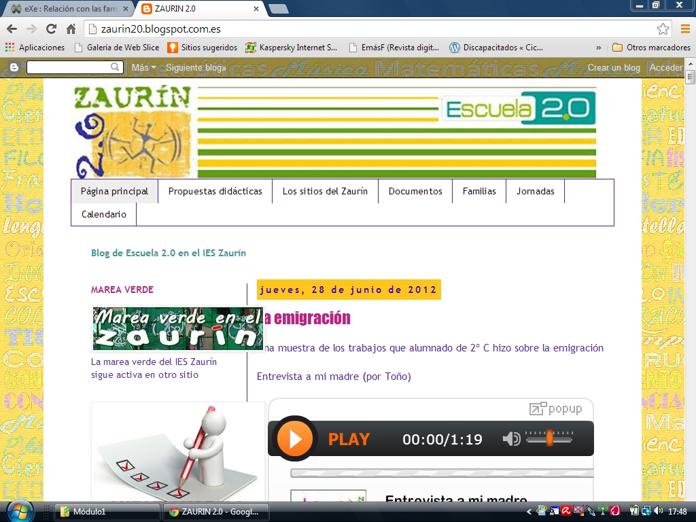

# U2. Wikis

Una Wiki es una colección de páginas o espacio Web que puede ser editado facilmente, en cualquier momento y desde cualquier lugar. Según su configuración puede ser modificado por los usuarios de forma completamente interactiva, en función de los permisos otorgados (abiertos, restringidos, cerrados) por lo que se convierte en el sistema de construcción de espacios comunes.

Su edición es intuitiva y visual, de forma que, sin más conocimientos técnicos que la edición de textos, la inserción de imágenes y el embeber códigos de otros servicios podemos crear páginas, de forma que no dependemos de un webmaster para editar y publicar los contenidos.

El sistema wiki crea, por detrás, una base de datos, pero no es preciso que tengamos conocimiento de estos gestores; mientras que su cara pública muestra una biblioteca compartida y colectiva de conocimiento que crece a medida que se van realizando nuevas aportaciones. Para garantizar la utilidad y fiabilidad de estas aportaciones es necesario establecer mecanismos de revisión y retroalimentación. La idea básica de su integración en el aula es que el profesor propone los conceptos a incorporar o bien los alumnos conocen que una de sus tareas a lo largo del tema es ir anotando aquellos conceptos susceptibles de incorporarse a la wiki. Serán ellos quienes introduzcan el contenido conceptual (textos, imágenes, vídeos y otros elementos multimedia web 2.0, preferentemente en grupos pequeños), revisarlos entre todos y, de esta forma, validar el contenido. El proceso de revisión puede realizarse en gran grupo, cuando repasemos contenidos o bien cada grupo pequeño, que ha introducido información revisa el contenido de otro grupo o de todos los restantes para, posteriormente, ponerlo en común. La retroalimientación que se deriva de todo este proceso es innegable, tanto desde el punto de vista de la materia o materias en si, como desde el desarrollo de las competencias básicas (digital, comunicativa, social, aprender a aprender, artística e, incluso, emocional) y ya no tenemos la excusa del copia-pega para no utilizar las TIC, pues durante el proceso de revisión los conceptos, las imágenes, los multimedias adquieren una forma definitiva construida entre todos.

Las distintas versiones de una misma página permiten poner en escena procesos de pensamiento cuando los usuarios interactúan sobre una misma página. Así pues, **las wikis complementan, mejoran y añaden una nueva dimensión al trabajo colaborativo en el aula que construye aprendizajes **utilizando una tecnología transparente y sencilla que, una vez liberados de la preocupación por la técnica, permite que nos centremos en la planificación, los procesos, los contenidos, los procedimientos, la evaluación... es decir, en el hecho educativo.

   <a title="View Wikis en Educacion on Scribd" href="https://www.scribd.com/document/36615552/Wikis-en-Educacion#from_embed"  style="text-decoration: underline;" >Wikis en Educacion</a> by <a title="View rexgue's profile on Scribd" href="https://es.scribd.com/user/118949/rexgue#from_embed"  style="text-decoration: underline;" >rexgue</a> on Scribd
<iframe class="scribd_iframe_embed" title="Wikis en Educacion" src="https://www.scribd.com/embeds/36615552/content?start_page=1&view_mode=scroll&access_key=key-2af2t8hlpbu7t3jof06m&show_recommendations=true" data-auto-height="false" data-aspect-ratio="0.75" scrolling="no" id="doc_2884" width="100%" height="600" frameborder="0"></iframe>

**Wikipedia**

*   [Wikipedia ](http://es.wikipedia.org/wiki/Wikipedia:Portada)es el referente de las wikis. Proponemos que, cuando una tarea de aula esté lo suficientemente elaborada, nuestros alumnos se conviertan en autores de la Wikipedia publicando el resultado de sus investigaciones sobre aspectos no contemplados en la enciclopedia. Sobre todo cuando trabajamos sobre la realidad circundante del barrio o la localidad, las entradas en wikipedia suelen escasear y nuestras aportaciones resultan estimulantes y se hacen muy populares entre la comunidad local. Incluye, entre otros proyectos:   
    *   [Wikimedia Commons](http://commons.wikimedia.org/wiki/Portada), un depósito centralizado de imágenes, música, sonido, video y grabaciones de textos utilizados en artículos en los diferentes proyectos del grupo con la característica de ser de uso libre o citando su procedencia.
    *   [Wikisource](http://es.wikisource.org/wiki/Portada) es una biblioteca en línea de textos originales que se encuentran en [dominio público](http://es.wikipedia.org/wiki/dominio_p%C3%BAblico "w:dominio público") o que hayan sido publicados con una licencia [GFDL](http://www.aularagon.org/Files/UserFiles/File/wiki/GNU/GFDL "GNU/GFDL") o [Creative Commons](http://creativecommons.org/licenses/by-sa/3.0/deed.es_CL).
    *   [Wikispecies ](http://species.wikimedia.org/wiki/Portada)es un nuevo proyecto de la [Fundación Wikimedia](http://wikimediafoundation.org/wiki/Portada "wikimedia:Portada") con un gran potencial. Se espera que se convierta en un repertorio abierto y libre de especies. Se cubrirán [animales](http://es.wikipedia.org/wiki/Animal "es:Animal"),[plantas](http://es.wikipedia.org/wiki/Planta "es:Planta"), [hongos](http://es.wikipedia.org/wiki/Hongo "es:Hongo"), [bacterias](http://es.wikipedia.org/wiki/bacteria "es:bacteria"), [protistas](http://es.wikipedia.org/wiki/Protista "es:Protista") y cualquier otra forma de vida en la medida que nuestros usuarios las vayan completando.
    *   [Simple english wikipedia](http://simple.wikipedia.org/wiki/Main_Page) es una enciclopedia que usa palabras sencillas y frases cortas, para que las personas que aprenden inglés, puedan leerla.
    *   [Wikilibros](http://es.wikibooks.org/wiki/Portada) tiene por objetivo poner a la disposición de cualquier persona libros de texto, manuales, tutoriales u otros textos pedagógicos de contenido libre y de acceso gratuito.

**¿Dónde pongo mi Wiki?**

*   El más conocido es [Wikispaces](http://www.wikispaces.com/), funciona en distintos idiomas. Cuando te registres no olvides solicitar el servicio para educación, de esta forma evitarás la publicidad.
*   [PBwiki ](http://www.genbeta.com/web/pbwiki-20-beta-monta-tu-propio-wiki)es otra opción.
*   Y muchos más...

**Algunos ejemplos:**

*   [Aulawiki ](http://aulablog21.wikispaces.com/EduWikis)es un sitio sobre wikis donde podrás encontrar desde técnica hasta modelos pasando por wikis educativas.
*   Wiki como construcción colaborativa del conocimiento. La wiki [Marcial ](http://marcial.wikispaces.com/)pertenece a un curso de preparación para las pruebas de acceso a grado medio al que asisten adultos que necesitan una cualificación profesional (conductores de ambulancia principalmente) y jóvenes que no han finalizado la ESO. La utilizamos para disponer de un compendio de los conceptos de Ciencias Sociales que nos salen en clase. Las entradas se seleccionan entre todos, a medida que avanzamos en los contenidos y las anotamos en un documento para preparar un índice de conceptos cuyas páginas están en blanco. Los alumnos buscan información sobre un concepto concreto en materiales escritos o en internet, donde es inevitable el copia y pega. En un segundo paso revisamos entre todos (el grupo no es muy numeroso) cada concepto y modificamos la redacción para que sea entendible, lo explicamos con nuestras palabras. Finalmente, redistribuimos la tarea y buscamos imágenes para cada concepto de forma que quien se encargó de la redacción inicial no busque la foto para ese concepto.
*   Para un [área o departamento](http://www.rafaelrobles.com/wiki/index.php?title=P%C3%A1gina_Principal).
*   Wiki de [centro](http://www.juntadeandalucia.es/averroes/~04001205/pmwiki/pmwiki.php).
*   Wiki de aula, [contes d'arreu del mon](http://contesdelmon.wikispaces.com/Presentaci%C3%B3).
*   Wiki combinada con WebQuest y Caza del tesoro sobre el [trabajo científico](http://www.juntadeandalucia.es/averroes/~04001205/pmwiki/pmwiki.php?n=Fyq.ElTrabajoCient%edfico).
*   Muchísimas wikis clasificadas y sin clasificar en [aulawiki](http://aulablog21.wikispaces.com/EduWikis).
*   [Aprende ](http://aulablog21.wikispaces.com/TALLER+DE+WIKIS)a hacer tu wiki, aunque dependerá de qué servicio utilices.
*   La wiki personal del [profesor](http://jr20.wikispaces.com/) para poner en la red sus aportaciones.

**En resumen**

*   Las wikis permiten crear un espacio de trabajo colaborativo y participativo.
*   Rompen la jerarquización y la unidireccionalidad del aprendizaje.
*   Rompen el espacio aula donde se había desarrollado hasta ahora la educación posibilitando la idea de la escuela en Internet.
*   Favorecen un tipo de aprendizaje colaborativo donde el conocimiento se construye entre todos los participantes.
*   Los profesores y los alumnos adoptan nuevos roles.