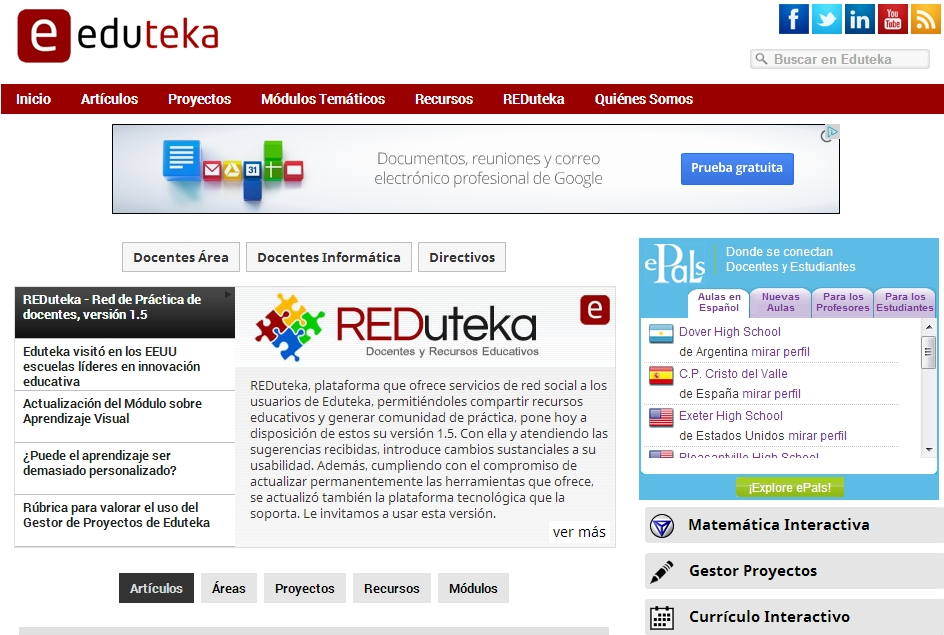

# U3. Proyectos de trabajo

Te proporcionamos varias fuentes para trabajar los proyectos de trabajo.

<iframe src="//www.slideshare.net/slideshow/embed_code/key/huGCKaG3mUuISy" width="595" height="485" frameborder="0" marginwidth="0" marginheight="0" scrolling="no" style="border:1px solid #CCC; border-width:1px; margin-bottom:5px; max-width: 100%;" allowfullscreen> </iframe> 
 <strong> <a href="//www.slideshare.net/camog70/aprendizaje-por-proyectos" title="Aprendizaje Por Proyectos" target="_blank">Aprendizaje Por Proyectos</a> </strong> from <strong><a href="https://www.slideshare.net/camog70" target="_blank">camog70</a></strong> 

**Algunos ejemplos:**

*   Dentro de la web [cuadernos de campo](http://www.catedu.es/cuaderno_campo/) encontrarás proyectos relacionados con el medio próximo para desarrollar en tercer ciclo de primaria y secundaria obligatoria.
*   En [CEPIndalo](http://recursos.cepindalo.es/course/view.php?id=143&topic=3), nos proponen desde Almería un proyecto para   
    
    *   **[Ciencias](http://recursos.cepindalo.es/course/view.php?id=143&topic=)**.
    
    *   [Lengua](http://recursos.cepindalo.es/course/view.php?id=156&topic=3)

**Para analizar el método de proyectos con participación de las tecnologías, recomendamos leer [los dos capítulos que Eduteka](http://www.eduteka.org/APPMoursund1.php) dedica al tema **_(puedes hacerlo desde el enlace o en el marco inferior)_**. Al final del mismo encontrarás algunos ejemplos.**

 Fig 6.5.Captura pantalla.