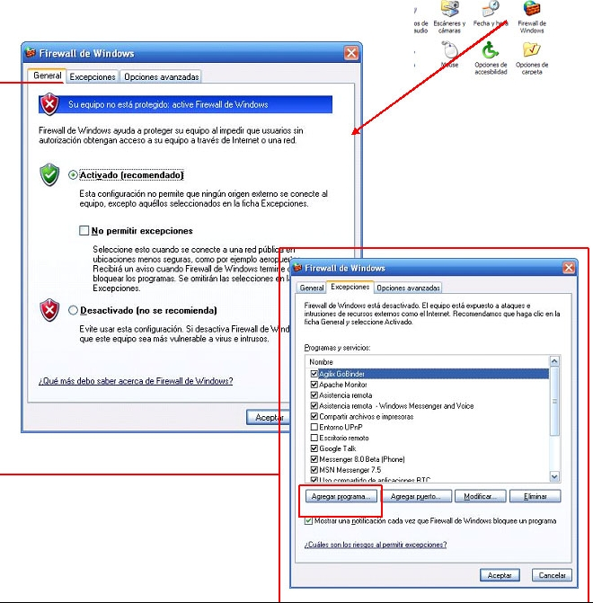
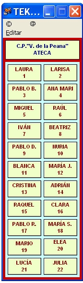

# U3.VNC-TEKLO

**VNC **son las siglas de "Virtual Network Computing", se trata de un sistema que permite ver y controlar desde el ordenador del profesor y, por lo tanto, proyectar en la PDI la pantalla de cualquier ordenador del aula o de otros lugares que estén en la misma red. Este programa de software libre vendrá instalado en nuestros ordenadores con una estructura cliente (ordenador del profesor) -servidor (ordenadores de los alumnos). De esta forma, desde el escritorio remoto podremos volcar en la pizarra el trabajo de cualquier alumno, y tomar el control de su ordenador remotamente para realizar correcciones, aclaraciones...

No entraremos en cuestiones de instalación y configuración del programa, ya que vendrá ya montado en los ordenadores de profesor y alumno, sin embargo, no está de más advertir que su funcionamiento precisa que el firewall de windows esté desactivado; al tratarse de una opción que, por demanda del propio sistema operativo, corremos el riesgo de activar, mostramos aquí un gráfico de como configurarlo desde el panel de control.

Fig 4.28.Captura pantalla

De todos modos, quien mejor solucionará el problema es el coordinador del programa Ramón y Cajal del centro.

**Un "teklo" para el VNC**
| |Con el fin de simplificar el trabajo con el programa VNC, Luis Fernando Martín Rosel y Mariano González Montero, ambos maestros del C.P. Virgen de la Peana de Ateca, han creado una aplicación de probada utilidad. Se trata de un teclado virtual que instalamos en el escritorio del ordenador del profesor y que contiene botones con los nombres de cada uno de nuestros alumnos y que enlazan directamente con el servidor VNC de cada uno de sus ordenadores. De esta forma, visualizar la pantalla o controlar el PC de uno de ellos esta a un clic de distancia.La primera vez que se utiliza es necesario configurarlo, es un proceso que se realiza en el ordenador del profesor, una sola vez y muy sencillo. Aunque se encargará de hacerlo el coordinador del Ramón y Cajal, no está de más que los restantes participantes le echéis una mano.Haz clik[ AQUI ](http://www.catedu.es/facilytic/2013/04/30/control-del-aula)para descargarte el Manual.  

 

 

## ParaSaberMas

VNC - TEKLO un programa que permite ver los ordenadores de los alumnos en el nuestro   * [Apuntes TEKLO III](https://docs.google.com/file/d/0B1EEDmBYIbaiY2QwMDJjMWQtZjgzYi00NTE5LWFjZDgtMWJiMTViOTc1MDc1/edit?hl=es) (autores Luis Fernando Martín Rosel y Mariano González Montero)[[fuente]](http://catedu.es/arablogs/blog.php?id_blog=1707)

* [Apuntes de cómo configurarlo y utilizarlo](http://catedu.es/aularagonpowerpoint/TEMATICOS/AULAYEDUCATIVOS/VNC.doc) * [Apuntes de cómo configurarlo en Windos 7 <small>(CPR1 Pilar Bazán y Felix) </small>VNC-W7.pdf       * Descarga del programa VNC Teklo](http://catedu.es/aularagonpowerpoint/TEMATICOS/AULAYEDUCATIVOS/VNC-W7.pdf)[ en el ordenador del profesor *](http://catedu.es/aularagonpowerpoint/TEMATICOS/AULAYEDUCATIVOS/VNC-W7.pdf) [Descarga del programa VNC en el ordenador de los alumnos](http://www.realvnc.com/products/download.html)

                                                                Fig 4.30. Captura pantalla

 

