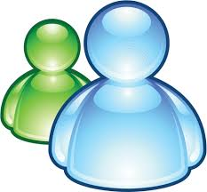

# U4. Un espacio para la comunicación

Pese a la extensión del **correo electrónico** entre nuestros alumnos, la mayoría tienen cuenta de hotmail, independientemente de que tengan o no ordenador en casa, hemos utilizado muy poco esta herramienta como entorno de comunicación didáctica, salvo en la formación a distancia. La posibilidad de escribir textos y adjuntar archivos o insertar imágenes hace del correo una vía de comunicación muy aprovechable para el aula. Nosotros les enviamos una tarea adjunta, ellos la completan y nos la reenvían, ese sería el modelo básico, pero puede desarrollarse mucho más si consideramos la posibilidad de mandar enlaces o imágenes y la creación de una cadena de correos donde podemos realizar actividades como intercambiar textos, continuarlos, proponer acertijos y enigmas, comunicarnos con otros centros de aquí o del extranjero...

En la actualidad, la utilización del correo web, en vez de los programas de correo tipo **outlook express**, facilita mucho su uso; por otra parte, ya hemos comentado que disponer de una cuenta en algunos servidores, como **gmail **proporciona no pocos recursos adicionales.

Es obvio que no nos gusta proporcionar nuestra dirección personal a los alumnos, pero podemos crear una profesional para relacionarnos con ellos.

Tampoco hemos utilizado demasiado el **chat**, precisamente sus cuentas de hotmail provienen de que ellos llegaron al messenger mucho antes que nosotros y allí se quedaron. Seguramente nos hemos asomado tímidamente a ese espacio ocupado por nuestros alumnos alguna vez, no nos ha gustado demasiado lo que hemos visto y nos hemos alejado negando con la cabeza. Crear una sala para el aula resulta interesante para compartir y comunicar cosas de clase y eso podemos hacerlo en cualquier medio público como hotmail, gmail...

Los **chats **tipo messenger proporcionan no pocas herramientas, como la voz, el vídeo o la posibilidad de intercambiar archivos y fotografías, lo que vuelve a proporcionarnos nuevas expectativas didácticas, sobre todo si trabajamos entre aulas en tiempo real, vernos y hablarnos en nuestro idioma o en la segunda lengua da otra dimensión a los intercambios escolares, a los **comenius **y a la cooperación con otras aulas; aquellas cartas que nos escribíamos con nuestra contraparte francesa en mis tiempos de bachillerato se convierten en audio e imágenes para los que, eso sí, necesitaremos cascos si lo hacemos en el aula. Tengamos en cuenta que una cámara emitiendo desde un ordenador se come buena parte de la **estrecha** banda ancha disponible, por lo que será necesario organizar bien las actividades. Recomiendo particularmente las posibilidades que ofrecen servicios como google, ya que no es necesario instalar ningún software en nuestro ordenador y, por lo tanto, vencen mejor las trincheras de los servidores educativos y me parece especialmente interesante usar algún tipo de videoconferencia en la web, como [tokbox](https://tokbox.com/), que proporcionan una dirección web a la que hay que invitar a los participantes.

Tampoco los **foros** han sido santo de nuestra devoción, proponer un tema de debate y permitir que los alumnos escriban sus opiniones y respondan a las opiniones de los demás resulta, además de educativo, entretenido. Los blog simplifican mucho los debates, colgando un artículo y abriéndolo a comentarios de los alumnos, pero también es posible en redes sociales como [Twitter ](http://twitter.com/)o en algún foro de los que ya existen en la red.

Ni siquiera las **videoconferencias **o las conversaciones con voz nos han gustado demasiado; sin embargo la posibilidad de comunicar unas aulas con otras a través de una cámara o un micrófono (y siempre con una tarea concreta) ofrece grandes posibilidades para compartir, alumno a alumno o clase a clase, momentos educativos, desde debates hasta puesta en común de conclusiones correspondientes a un proyecto que hemos trabajado en dos lugares diferentes, pasando por aprendizaje de idiomas conversando vis a vis, pero a miles de kilómetros de distancia.

Entre nuestras preferencias están los servicios ofrecidos desde **[google](http://www.google.es/intl/es/about/products/)**, que no sólo facilitan la conversación, sino el intercambio de documentos si usamos google docs y otras muchas posibilidades de comunicación, entre otras:

- [Orkut](http://www.orkut.com/) es una red social a la que solo se puede acceder mediante invitación o con una cuenta de Google.
- [Picasa](http://picasa.google.com/) es un fantástico organizador de fotos digitales e imágenes para tú escritorio.
- Servicios como [Tokbox](http://www.tokbox.com/) (ahora open tok) permiten realizar videoconferencias en la Web; quien la organiza envía un mensaje con la dirección de la sesión al resto de los participantes, que sólo tienen que entrar en esa página. Entre otras cosas permite dejar videomensajes a quien está dado de alta.

